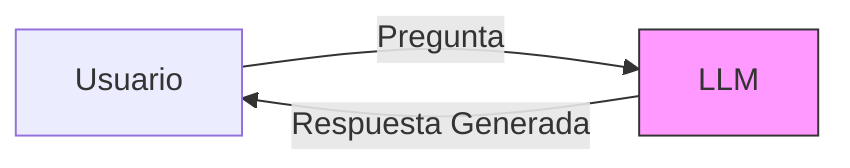
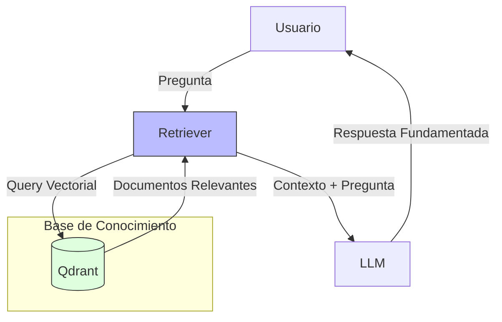
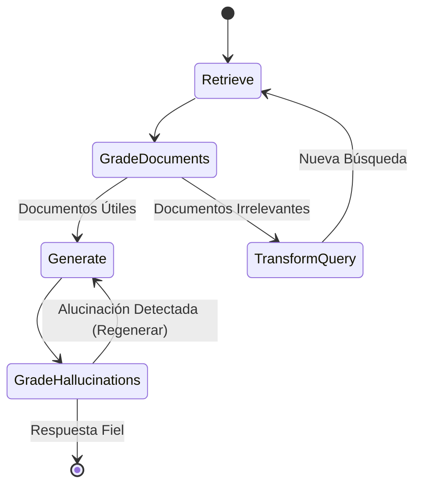

# Arquitectura, Manual y Comparativa Técnica: Arándanos AI

Este documento unifica la descripción arquitectónica, la comparativa de modelos (V0, V1, V2) y el manual de uso de la plataforma **Arándanos AI**.

## 1. Propósito del Proyecto

Este proyecto es un Trabajo de Fin de Máster (TFM) enfocado en **mitigar y medir alucinaciones** en Modelos de Lenguaje (LLMs) aplicados a la agricultura (manejo de arándanos).

El sistema compara tres niveles de sofisticación en la generación de respuestas:
1.  **V0 (Baseline)**: Chat básico. Alta propensión a alucinar.
2.  **V1 (RAG)**: Retrieval-Augmented Generation. Contexto validado.
3.  **V2 (Agente RAG)**: Sistema autónomo con mitigación activa y auto-corrección.

---

## 2. Comparativa de Modelos (V0 vs V1 vs V2)

Esta sección detalla las diferencias fundamentales entre las tres arquitecturas implementadas.

### 2.1 V0: Modelo Base (Baseline)

El modelo **V0** representa la interacción directa con el LLM (Gemini, Llama, Qwen, etc.) sin contexto externo. Sirve como línea base para medir la "alucinación pura" del modelo.



*   **Contexto**: Cero. Solo conocimiento pre-entrenado.
*   **Alucinaciones**: Altas.
*   **Latencia**: Mínima.

### 2.2 V1: RAG Estándar (Retrieval-Augmented Generation)

La versión **V1** implementa un pipeline **RAG** clásico. Busca fragmentos en Qdrant y los inyecta en el prompt.



*   **Mejora**: Acceso a documentos específicos (PDFs, papers).
*   **Limitación**: Si la búsqueda falla, el modelo puede alucinar o no responder. Pipeline lineal.

### 2.3 V2: Agente Autónomo (LangGraph)

La versión **V2** es un **Agente Cognitivo** con un grafo de estados que permite **Self-Correction**.

El agente V2 implementa **RAG Activo**:
1.  **Planificación**: Decide si necesita buscar.
2.  **Recuperación & Evaluación**: Verifica si los documentos recuperados son relevantes. Si no, reescribe la búsqueda.
3.  **Generación & Verificación**: Evalúa si su propia respuesta tiene alucinaciones antes de entregarla al usuario.



**Ventajas de V2:**
*   **Resiliencia**: Reintenta búsquedas fallidas.
*   **Auto-Corrección**: Verifica hechos internos ('Grader').
*   **Fiabilidad**: Reduce drásticamente las alucinaciones al "pensar" antes de hablar.

### Tabla Comparativa Resumen

| Característica | V0 (Baseline) | V1 (RAG Estándar) | V2 (Agente Autónomo) |
| :--- | :--- | :--- | :--- |
| **Arquitectura** | Directa (Prompt -> LLM) | Cadena Lineal | Grafo Cíclico (LangGraph) |
| **Conocimiento** | Paramétrico | Contextual (Vectorial) | Contextual + Razonamiento |
| **Búsqueda** | Nula | Estática (1 intento) | Dinámica (Reintentos) |
| **Control de Calidad** | Ninguno | Prompt Engineering | Nodos de Evaluación (Grader) |
| **Mitigación Alucinación**| Baja | Media-Alta | **Muy Alta** |
| **Latencia** | Baja (~1s) | Media (~3s) | Alta (~5-15s) |

---

## 3. Arquitectura General del Sistema

El sistema backend/frontend interactúa de la siguiente manera:

```mermaid
graph TD
    User[Usuario / Streamlit] --> App[App Unificada]
    
    subgraph "Niveles de Inteligencia"
        App -->|Tab V0| Baseline[LLM Standard]
        App -->|Tab V1| RAG[Motor RAG]
        App -->|Tab V2| Agent[Agente LangGraph]
    end
    
    subgraph "Procesamiento Asíncrono"
        App -.->|Encolar Job| Redis[Redis Queue]
        Redis --> Worker[RQ Worker]
        Worker -->|Cálculo Pesado| FactScore[Métrica FactScore]
        Worker -.->|Resultado| Redis
    end

    subgraph "Componentes Compartidos"
        RAG & Agent --> VectorDB[Qdrant (Documentos)]
        RAG & Agent --> Metrics[Sistema de Métricas]
        Worker --> Metrics
    end
```

## 4. Estructura del Código

### `src/`
*   `core/`: Configuración (`settings.py`) y Factory de LLMs (`providers/`).
*   `knowledge/`: Carga de documentos (`loaders.py`) e indexación vectorial (`indexer.py`).
*   `chat/`: Lógica V1 (RAG lineal).
*   `agent/`: Lógica V2 (LangGraph, nodos, estados).
*   `metrics/`: Jueces LLM (`faithfulness`, `context_relevance`) y `factscore`.
*   `ui/`: Componentes de Streamlit (`tabs/`, `utils.py`).

### `services/`
*   `worker/`: Tareas en background (Redis Queue) para métricas pesadas.

## 5. Manual de Despliegue y Uso

### Requisitos Previos
*   Docker & Docker Compose.
*   Python 3.10+ y `uv` (opcional, para desarrollo local).

### Pasos de Instalación

1.  **Despliegue Completo (Recomendado)**:
    ```bash
    docker-compose up -d --build
    ```
    Esto levanta: App (8501), Qdrant (6333), Redis (6379), Ollama (11434) y Worker.

2.  **Configuración e Ingesta**:
    *   Si es la primera vez, ejecuta el script de, setup que descarga modelos e indexa documentos:
    ```bash
    uv run scripts/setup_and_ingest.py
    ```
    *   Para re-indexar forzosamente (si cambias embeddings):
    ```bash
    uv run scripts/setup_and_ingest.py --skip-ollama  # (El script detectará si indexar es necesario)
    ```

3.  **Uso de la Aplicación**:
    *   Acceder a `http://localhost:8501`.
    *   **Tab V0/V1/V2**: Chat interactivo para probar cada modelo.
    *   **Tab Comparación**: Lanza una misma pregunta a los 3 modelos simultáneamente.
    *   **Tab Reportes**: Ejecuta benchmarks masivos sobre `data/questions.csv`.

### Notas sobre Embeddings
El sistema usa por defecto `mxbai-embed-large` (1024 dimensiones) para una recuperación SOTA en español/inglés. Si necesitas cambiarlo, edita `src/core/config/settings.py` y re-ejecuta `setup_and_ingest.py`.
