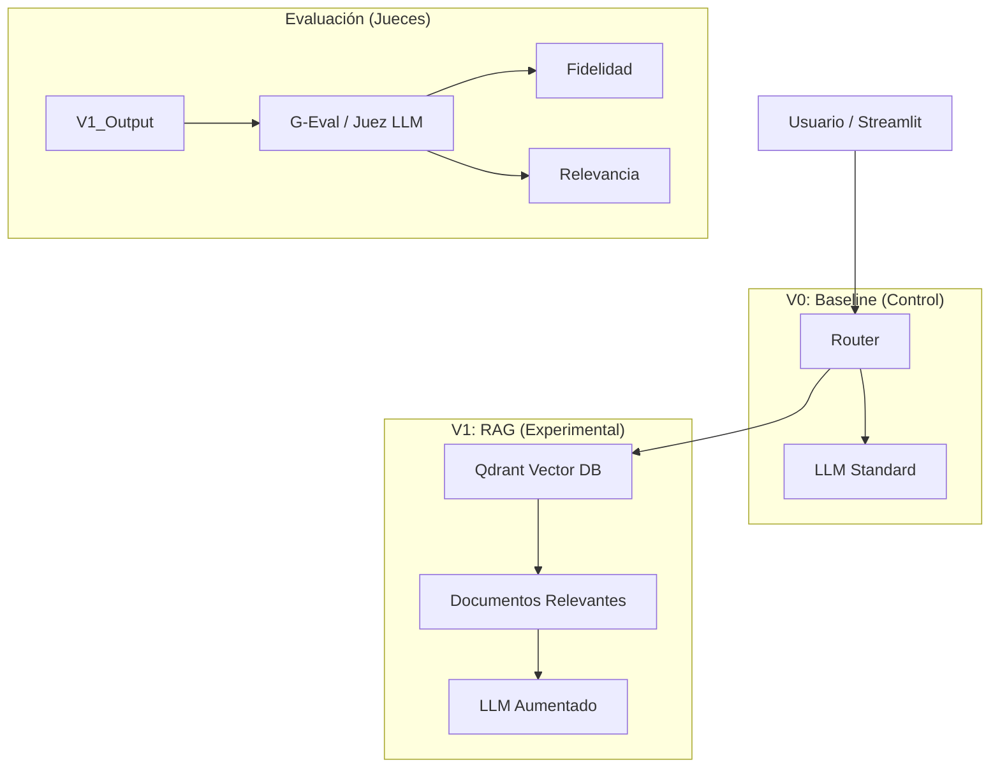

# Arquitectura y Manual del Proyecto TFM Allucination

## 1. Propósito del Proyecto
Este proyecto es un Trabajo de Fin de Máster (TFM) enfocado en **mitigar y medir alucinaciones** en Modelos de Lenguaje (LLMs) aplicados a la agricultura (específicamente manejo de arándanos).

El sistema compara dos enfoques:
1.  **V0 (Baseline)**: El LLM responde usando solo su conocimiento pre-entrenado (zero-shot).
2.  **V1 (RAG)**: Retrieval-Augmented Generation. El LLM responde usando documentos oficiales indexados (SENASA, SAG, etc.).

## 2. Arquitectura del Sistema

El sistema sigue una arquitectura modular "Agentic" simplificada:

## 3. Estructura de Archivos

### `src/` (Código Fuente)
El núcleo de la lógica del negocio.

#### `src/core/`
Configuración base y proveedores de modelos.
-   `config/settings.py`: Variables de entorno y configuración global (Pydantic).
-   `config/model_registry.json`: Base de datos local de modelos soportados (Gemini, OpenRouter, etc.).
-   `providers/factory.py`: Patrón Factory para instanciar LLMs dinámicamente.
-   `providers/gemini.py`, `ollama.py`, `openrouter.py`: Adaptadores para cada API.
-   `providers/embeddings.py`: Generación de embeddings (Gemini Text-Embedding-004).

#### `src/knowledge/`
Gestión del conocimiento e ingestión de documentos.
-   `loaders.py`: Cargadores robustos para PDF, DOCX (Word) y XLSX (Excel). Conversión a Markdown.
-   `indexer.py`: Script para leer `corpus/raw`, dividir en chunks e indexar en Qdrant.

#### `src/chat/`
Lógica de conversación.
-   `rag.py`: Motor RAG. Define la cadena de procesamiento: `Pregunta -> Retrieval -> Prompt -> Generación`.

#### `src/metrics/`
Evaluación automática (LLM-as-a-Judge).
-   `judges.py`: Factory para el LLM que actúa como juez (suelen ser modelos potentes).
-   `faithfulness.py`: Mide si la respuesta inventó algo fuera del contexto.
-   `context_relevance.py`: Mide si lo recuperado sirve para la pregunta.

### `eval/` (Benchmarking)
Scripts para ejecutar pruebas masivas.
-   `question_bank_v1.csv`: Banco de preguntas "Gold Standard" con fuentes esperadas.
-   `run_eval.py`: Ejecuta el banco de preguntas en V0 y V1 y guarda latencia/respuestas.
-   `run_metrics.py`: Toma las respuestas y calcula puntajes de alucinación (0.0 a 1.0).

### `corpus/`
Datos crudos.
-   `raw/`: Archivos PDF, DOCX, XLSX originales.
-   `registry.yaml`: Metadatos de los documentos (título, país, año).

### Raíz
-   `app.py`: Interfaz de usuario (Frontend) construida con **Streamlit**. Permite chat interactivo y ver métricas en tiempo real.

## 4. Flujo de Trabajo Típico

1.  **Ingesta**: 
    -   Se añaden archivos a `corpus/raw`.
    -   Se añade entrada a `corpus/registry.yaml`.
    -   Se ejecuta `uv run src/knowledge/indexer.py` para actualizar la base vectorial.

2.  **Evaluación (Batch)**:
    -   Se edita `eval/question_bank_v1.csv` con nuevas preguntas.
    -   Se ejecuta `uv run eval/run_eval.py` para generar respuestas.
    -   Se ejecuta `uv run eval/run_metrics.py` para calificar.

3.  **Uso Interactivo**:
    -   Se lanza `uv run streamlit run app.py`.
    -   Se chatea validando V0 vs V1 en caliente.

## 5. Tecnologías Clave
-   **LangChain**: Orquestación de cadenas y RAG.
-   **Qdrant**: Base de datos vectorial (Persistencia local en `qdrant_storage`).
-   **Streamlit**: UI rápida.
-   **Google Gemini / Ollama / OpenRouter**: Proveedores de Inteligencia Artificial.
