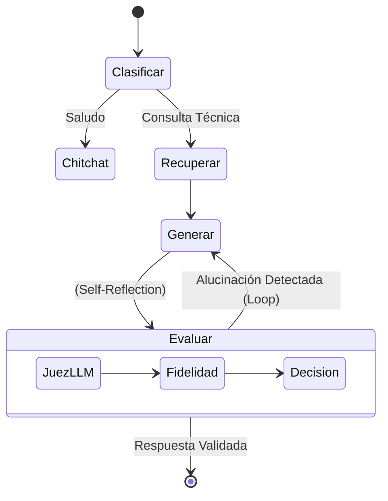

# Arquitectura y Manual del Proyecto TFM Allucination

## 1. Propósito del Proyecto
Este proyecto es un Trabajo de Fin de Máster (TFM) enfocado en **mitigar y medir alucinaciones** en Modelos de Lenguaje (LLMs) aplicados a la agricultura (manejo de arándanos).

El sistema compara tres niveles de sofisticación:
1.  **V0 (Baseline)**: Chat básico. El LLM responde usando solo su entrenamiento (zero-shot). Alta propensión a alucinar.
2.  **V1 (RAG)**: Retrieval-Augmented Generation. El LLM recibe contexto validado de documentos oficiales (SENASA, SAG, Manuales).
3.  **V2 (Agente RAG)**: Sistema autónomo con **Mitigación Activa**. Usa ciclos de feedback y auto-corrección para verificar sus propias respuestas antes de entregarlas.

## 2. Arquitectura del Sistema

El sistema implementa una arquitectura incremental:

### Diagrama General

```mermaid
graph TD
    User[Usuario / Streamlit] --> App[App Unificada]
    
    subgraph "Niveles de Inteligencia"
        App -->|Tab V0| Baseline[LLM Standard]
        App -->|Tab V1| RAG[Motor RAG]
        App -->|Tab V2| Agent[Agente LangGraph]
    end
    
    subgraph "Procesamiento Asíncrono"
        App -.->|Encolar Job| Redis[Redis Queue]
        Redis --> Worker[RQ Worker]
        Worker -->|Cálculo Pesado| FactScore[Métrica FactScore]
        Worker -.->|Resultado| Redis
    end

    subgraph "Componentes Compartidos"
        RAG & Agent --> VectorDB[Qdrant (Documentos)]
        RAG & Agent --> Metrics[Sistema de Métricas]
        Worker --> Metrics
    end
```

### Detalle del Agente V2 (LangGraph)

El Agente V2 implementa un grafo de estados para auto-corrección:



## 3. Estructura de Archivos

### `Dockerfile` & `docker-compose.yml`
Definición de infraestructura contenerizada (App, Worker, Qdrant, Redis, Ollama).

### `src/` (Código Fuente)

#### `src/core/`
Infraestructura base.
-   `config/`: `settings.py` (ENV) y `model_registry.json`.
-   `providers/`: Factory para LLMs (Gemini, Ollama, OpenRouter).

#### `src/knowledge/`
Gestión del conocimiento (RAG).
-   `loaders.py`: Extracción robusta de texto (PDF/Word/Excel) con limpieza de cabeceras.
-   `indexer.py`: Segmentación (chunking) e indexación vectorial en Qdrant.

#### `src/chat/`
Lógica conversacional V1.
-   `rag.py`: Pipeline lineal `Retrieve -> Synthesize`.

#### `src/agent/` (NUEVO V2)
Lógica agéntica V2.
-   `graph.py`: Definición del grafo de estados (LangGraph).
-   `nodes.py`: Funciones de los nodos (Clasificar, Generar, Evaluar).
-   `state.py`: Definición del estado compartido del agente (`AgentState`).

#### `src/metrics/`
Sistema de Evaluación "Triple Capa".
-   `faithfulness.py` (G-Eval): ¿La respuesta es fiel al contexto recuperado?
-   `context_relevance.py`: ¿La recuperación fue útil?
-   `factscore.py`: **Granularidad Atómica**. Descompone la respuesta en hechos simples y verifica cada uno.

#### `services/` (Backend Asíncrono)
-   `worker/tasks.py`: Definición de tareas pesadas (FactScore) para ejecución en background.

### `eval/` (Benchmarking)
-   `question_bank_v1.csv`: 12 Preguntas "Gold Standard" de alta complejidad técnica.
-   `run_eval.py`: Generación batch de respuestas V0/V1.
-   `run_metrics.py` & `run_factscore.py`: Cálculo masivo de métricas.

### `app.py` (Frontend)
Aplicación unificada en **Streamlit** con pestañas para comparar V0, V1 y V2.
- **Nueva Pestaña**: "📊 Reportes & Eval" para ejecución autómata de benchmarks y generación de informes Markdown.

## 4. Flujo de Trabajo Típico (Docker)

1.  **Despliegue Completo**:
    ```bash
    docker-compose up -d --build
    ```

2.  **Ingesta de Documentos** (Solo primera vez): 
    -   Colocar PDFs en `corpus/raw`.
    -   `docker exec -it tfm-app uv run src/knowledge/indexer.py`.

3.  **Demo y Evaluación**:
    -   Acceder a `http://localhost:8501`.
    -   Usar pestaña **"📊 Reportes & Eval"** para correr benchmarks completos.
    -   Descargar reporte final en Markdown.

## 5. Tecnologías Clave
-   **LangGraph**: Orquestación de agentes cíclicos (Stateful).
-   **LangChain**: Cadenas base y prompts.
-   **Qdrant**: Base de datos vectorial persistente.
-   **Ollama / Gemini**: Modelos de lenguaje.
-   **Streamlit**: Interfaz de usuario.
