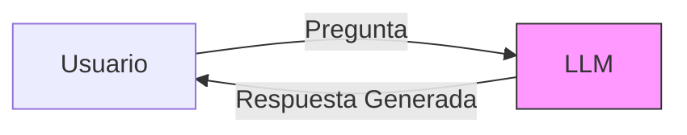
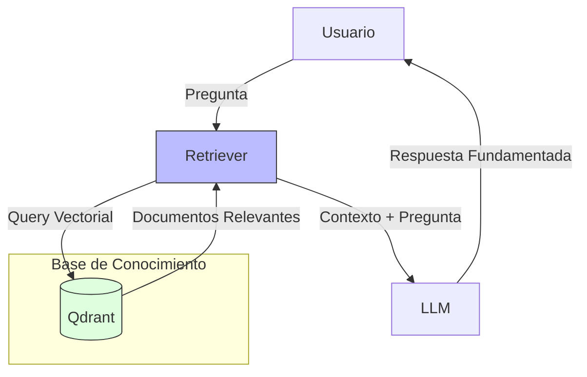
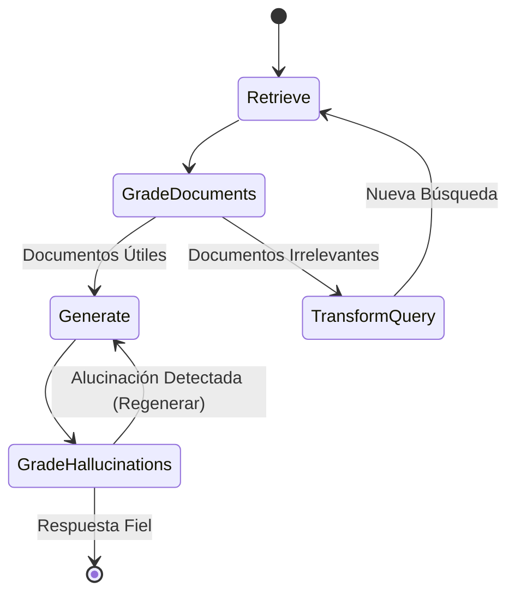

# Comparativa Técnica de Arquitecturas: V0 vs V1 vs V2

Este documento detalla las diferencias arquitectónicas, flujos de datos y capacidades de las tres versiones implementadas en la plataforma **Arándanos AI**.

## 1. V0: Modelo Base (Baseline)

El modelo **V0** representa la interacción directa con el LLM (Gemini, Llama, Qwen, etc.) sin ningún tipo de contexto externo ni herramientas. Sirve como línea base para medir la "alucinación pura" del modelo cuando se le pregunta sobre temas específicos (fitosanidad) que no están en su entrenamiento reciente o detallado.

### Flujo de Datos (V0)

**Características:**
*   **Contexto**: Cero. Solo el conocimiento paramétrico del modelo.
*   **Alucinaciones**: Altas. El modelo inventa datos plausibles pero falsos.
*   **Latencia**: Mínima.
*   **Costo**: Bajo (1 llamada).

---

## 2. V1: RAG Estándar (Retrieval-Augmented Generation)

La versión **V1** implementa un pipeline **RAG** clásico. Antes de responder, el sistema busca fragmentos relevantes en la base de datos vectorial (Qdrant) y los inyecta en el prompt del sistema.

### Flujo de Datos (V1)

**Mejoras respecto a V0:**
*   **Contexto**: Acceso a documentos específicos indexados (PDFs, papers).
*   **Alucinaciones**: Reducidas significativamente, pero posibles si el contexto es irrelevante o el modelo lo ignora.
*   **Latencia**: Media (Búsqueda + Generación).

---

## 3. V2: Agente Autónomo (LangGraph)

La versión **V2** es un **Agente Cognitivo** diseñado con `LangGraph`. A diferencia del pipeline lineal de V1, V2 tiene un **grafo de estados** que le permite razonar, evaluar su propia respuesta y corregirse (Self-Correction).

El agente V2 implementa **RAG Activo**:
1.  **Planificación**: Decide si necesita buscar información.
2.  **Recuperación**: Ejecuta la búsqueda en Qdrant.
3.  **Evaluación (Grader)**: Un nodo "juez" interno evalúa si los documentos recuperados son relevantes.
    *   Si NO son relevantes -> Reescribe la búsqueda y vuelve a intentar.
4.  **Generación**: Genera la respuesta.
5.  **Verificación Final**: Evalúa si la respuesta generada sufre de alucinaciones.
    *   Si ALUCINA -> Regenera la respuesta.

### Flujo de Datos (V2) - Diagrama Simplificado

**Por qué V2 es superior a V1:**
*   **Resiliencia**: Si la primera búsqueda falla (V1 simplemente respondería con "no sé" o alucinaría), V2 reescribe la query y prueba de nuevo.
*   **Auto-Corrección**: V2 verifica sus propios hechos antes de responder al usuario. Funciona como un "doble check" interno.
*   **Adaptabilidad**: Puede manejar preguntas complejas descomponiéndolas (si se implementa ese nodo) o rechazando preguntas fuera de dominio.

---

## Tabla Comparativa Resumen

| Característica | V0 (Baseline) | V1 (RAG Estándar) | V2 (Agente Autónomo) |
| :--- | :--- | :--- | :--- |
| **Arquitectura** | Directa (Prompt -> LLM) | Cadena Lineal (Retriever -> LLM) | Grafo Cíclico (LangGraph) |
| **Conocimiento** | Paramétrico (Pre-entrenado) | Contextual (Base Vectorial) | Contextual + Razonamiento |
| **Búsqueda** | Nula | Estática (1 intento) | Dinámica (Reintentos con Query Rewriting) |
| **Control de Calidad** | Ninguno | Prompt Engineering | Nodos de Evaluación (Grader) |
| **Mitigación de Alucinaciones** | Baja | Media-Alta | **Muy Alta** (Ciclos de corrección) |
| **Latencia** | Baja (~1-2s) | Media (~3-5s) | Alta (~5-15s, variable según ciclos) |
| **Complejidad** | Trivial | Moderada | Alta |

---

## Conclusión

La evolución de V0 a V2 demuestra el camino desde un modelo de lenguaje "crudo" hasta un sistema de IA robusto y confiable. Mientras que **V1** soluciona el problema de la falta de conocimiento específico, **V2** soluciona el problema de la fiabilidad y la robustez ante fallos de recuperación, acercándose más a un experto humano que verifica sus fuentes antes de hablar.
