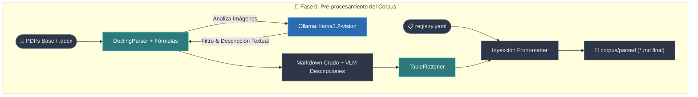
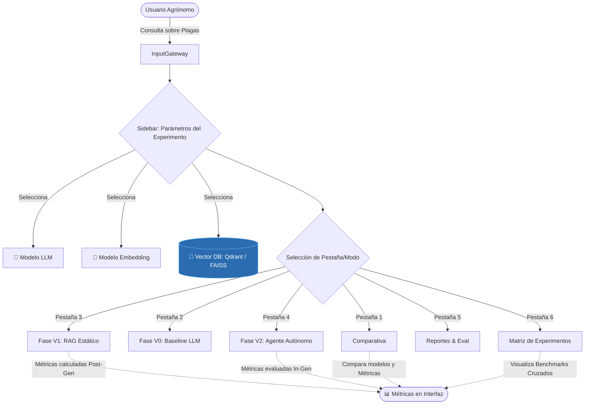
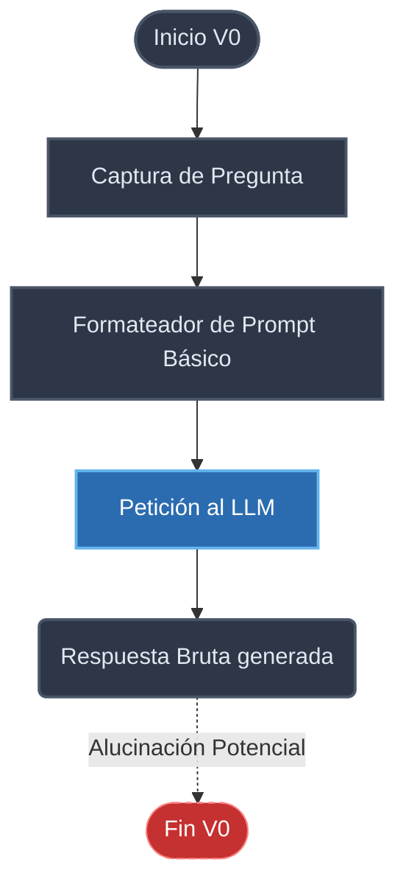
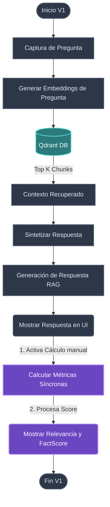
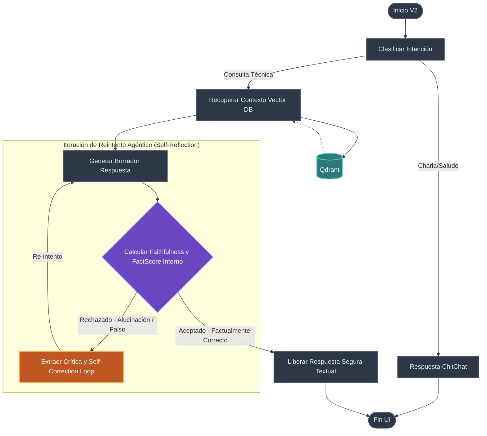
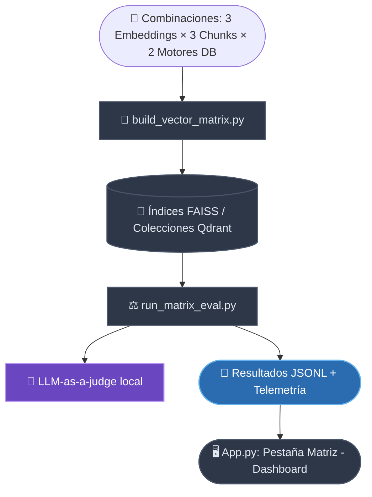

# 🧠 Modelos de Lenguaje aplicados a la Agricultura: Documentación y Arquitectura

Este documento proporciona una revisión a fondo del Trabajo de Fin de Máster (TFM) focalizado en erradicar y mitigar alucinaciones de Modelos de Lenguaje (LLM) aplicados a casos agronómicos, específicamente en consultas de fitosanidad y arándanos.

---

## 0. Pre-procesamiento del Corpus (Ingesta Estructurada)

Antes de que cualquier fase (V0, V1, V2) pueda operar, el corpus de documentos técnicos (PDFs) debe ser procesado e indexado en un formato enriquecido y estructurado que preserve el significado original para maximizar la calidad del contexto del RAG.

El orquestador central de este proceso se encuentra en `scripts/preprocess_corpus.py`, el cual se integra íntimamente con los analizadores y extractores robustos definidos en `src/knowledge/parsers.py`.

### Funcionalidad Clave del Pipeline (`preprocess_corpus.py` & `parsers.py`)

1. **Extracción Estructurada y Matemática (`DoclingParser`)**: 
   Se utiliza **Docling** para procesar los PDFs. A diferencia de un OCR tradicional de texto plano (como `PyPDFLoader`), preserva de forma nativa la estructura semántica de hojas y documentos, como listas, relaciones y componentes jerárquicos. Además, convierte todas las **fórmulas matemáticas** en sintaxis renderizable LaTeX nativamente.
   
2. **Inferencia Visual Integrada (`ImageFilter` y VLM Local)**: 
   Cuando el sistema cuenta con parámetros para ello, si `DoclingParser` detecta una imagen (gráfico, diagrama de flujo, mapa o fotografía útil), la extrae, formatea y la envía a un modelo visual ligero local (por defecto `llama3.2-vision` gestionado por Ollama configurado de forma **determinista** limitando temperatura y penalizaciones agresivas de tokens repetitivos en CPU).
   - El script actual actúa como un estricto **Guardarraíl (Guardrail)**: Si la imagen es detectada como un simple logo de senasa, una barra de decoración vertical o un elemento decorativo de marca sin datos útiles, el modelo omite el texto respondiendo de forma exacta la marca `DESCARTAR`.
   - Si la imagen contiene información semántica técnica real, genera su descripción textual (anclada según sus instrucciones de prompt de 2 o 3 sentencias) y automáticamente la inyecta en el documento de origen estructurado Markdown a través de la etiqueta de identificación semántica `> **[💡 Descripción de Imagen VLM]:** ...`.

3. **Aplanamiento Analítico de Tablas (`TableFlattener`)**: 
   Los LLMs padecen de rendimiento al leer grandes tablas de Markdown, y los generadores de `Embeddings` tienden a estropear el contexto al realizar un *chunking* ciego seccionándolas de manera errática. 
   El script orquestador utiliza `TableFlattener` para buscar mediante una regex los bloques de sintaxis nativa de tabla insertada, e itera relacionando individualmente los valores de cada celda de contenido referenciándolas siempre con sus cabeceras estéticas principales y nombre del archivo original de dónde proviene dicha relación general y año, convirtiendo finalmente matrices enteras tubulares o cuadriculadas en oraciones descriptivas amigables naturales para ser altamente leídas (`Dense High-Quality Retrieval`).

4. **Inyección de YAML y Metadatos (Front-matter)**: 
   A partir del índice manual central (`corpus/registry.yaml`), el orquestador se provee de datos crudos, para finalmente anexar un encabezado a cada documento extraído y refinado (Front-matter) con ID oficial de registro, País, Título, Año o Tags de dominio predeterminando enriquecimientos finales. Todo ello se extrae directamente para uso de la fase posterior y vector store a la carpeta de ingesta final listada `corpus/parsed`.

### Diagrama del Proceso de Pre-procesamiento de Archivos

### Ejemplo Crítico: Impacto Semántico de Tablas (Flattening)

Si Docling expulsa una tabla de `FRAC Code List`:

| FRAC Code | Chemical Group | Active Ingredient | Comments |
|-----------|---------------|-------------------|----------|
| 11 | QoI | azoxystrobin | Resistance common |

Se transformará programáticamente de celda-a-cabecera iterativamente para ser *chunking-friendly* de esta robusta manera inyectando también el origen de dicha fila desde el *registry*:

> *"Según FRAC Code List (2024), FRAC Code: 11, Chemical Group: QoI, Active Ingredient: azoxystrobin, Comments: Resistance common."*

## 1. Visión General del Sistema y Arquitectura Core

El código fuente del sistema reside mayoritariamente en `src/`, dividido de tal manera que las responsabilidades están fuertemente aisladas:

*   **`src/core/`**: Configuración fundamental, definición del proveedor, fábrica y parseo del registro de herramientas y capacidades del LLM de `model_registry.json`. Gestiona los wrappers de modelo (Gemini, OpenRouter, Ollama local).
*   **`src/chat/`**: Contiene la lógica del **RAG (V1)** puro, implementando cadenas Retriever y Augmenters clásicos con `LangChain`.
*   **`src/agent/`**: Posee el diseño del **Agente (V2)** construido con `LangGraph`. Define el Grafo de Decisión y el flujo asincrónico para determinar ciclos de auto-corrección basados en heurísticas o validaciones de calidad.
*   **`src/knowledge/`**: Se enfoca en Ingesta y Recuperación (`Retrieval`). Administra procesos como parseo de PDF/XLSX hacia Qdrant y la lógica de Text Splitting vectorizado.
*   **`src/metrics/`**: Los validadores. Producen métricas duras como Relevancia, Faithfulness (fidelidad por LLM-as-a-judge) y **FactScore**, este último usado para contrastar la atomicidad de las sentencias del LLM contra el Vector DB.
*   **`eval/`** y **`reports/`**: Scripts síncronos y comparativos. Generan en `reports/*.md` comparaciones tabulares con datos empíricos de ejecución.

### Pipeline Global de Enrutamiento

El sistema evalúa la consulta del usuario y, dependiendo del modo seleccionado en la interfaz, enruta la petición hacia la fase correspondiente:

---

## 2. Fase V0: Baseline LLM (Sin Contexto)

La **Fase V0** representa la interacción pura con el Modelo de Lenguaje, sin conocimiento externo (Zero-Shot). El objetivo de esta fase es demostrar el estado de alucinación predeterminado de los modelos cuando enfrentan o desconocen escenarios locales específicos.

### Flujo de Ejecución V0

*   El usuario envía la consulta.
*   El modelo genera una respuesta basándose únicamente en sus pesos preentrenados.
*   **Métricas:** En esta vista no se calculan métricas complejas de validación estructurada durante el flujo, ya que sirve de punto de comparación puramente base. Se confía en la experimentación visual del usuario frente a V1 o V2.

---

## 3. Fase V1: RAG Estático (Retrieval-Augmented Generation)

La **Fase V1** integra un sistema de Búsqueda Vectorial Semántica. Antes de enviar el prompt al LLM, examina la base de datos (Qdrant) iterando hasta hallar los "chunks" (fragmentos) más correlacionados a la consulta agronómica.

### Flujo y Cálculo de Métricas en V1

*   Se formatea un prompt estricto prohibiendo el uso de conocimiento general y exigiendo soporte textual (referencia).
*   **Aparición de las Métricas:** Las métricas de Fidelidad (*Faithfulness*), Relevancia y *FactScore* se evalúan de forma síncrona **después** de generar la respuesta total al usuario. Sirven como instrumento de reporte pasivo, ilustrando al operario cuán fiable fue el RAG en esa respuesta, pero **no detienen ni autocorrigen** alucinaciones pre-entregas.

---

## 4. Fase V2: Agente Autónomo (LangGraph) con Autocorrección

La **Fase V2** es el verdadero nivel cognitivo. Implanta un "Agente Cíclico" programado para desconfiar de sí mismo. Transforma las **métricas en reglas de enrutamiento interno** actuando como un supervisor autocrítico (AI self-reflection).

### Flujo y Evaluación Interna (NodeEvaluate) en V2

*   El Agente primero clasifica si la "Intención" del usuario es charlar o requiere una evaluación de la DB vectorizada.
*   Tras intentar un boceto/borrador de respuesta, entra en **`NodeEvaluate`**.
*   **Uso Activo de Métricas:** A diferencia de V1, V2 re-promptea al juez LLM midiendo el *Faithfulness*. Si la puntuación ("Score") detectada es inferior al umbral, se toma la "Razón de Alucinación" devuelta y se activa la transición **Self-Correction Loop**.
*   Se rechaza si el LLM extrajo dosis erróneas, productos cruzados o métodos inconexos con los documentos, propiciando un nuevo intento (hasta un límite de retries máximo). Sólo avanza y muestra al usuario si su pureza es validada.

---

## 5. Matriz de Experimentos y Evaluaciones Cruzadas

Para dar validez científica al TFM, se incluye un módulo de **Evaluación Cruzada (Matriz de Experimentos)** que aísla variables y mide el impacto de la precisión de recuperación vs el razonamiento del LLM.

### Arquitectura de la Matriz

*   **Variables de Entrada:**
    *   *Slicing:* 3 modelos de embeddings × 3 estrategias de chunking × 2 motores DB (FAISS y Qdrant local).
*   **Orquestación:** `eval/run_matrix_eval.py` itera permutaciones, inyecta el `vector_store` configurado en `RAGEngine` y computa las métricas de Calidad de Contexto y Fidelidad.
*   **Telemetría:** Mide y desglosa el tiempo de espera por llamada a base de datos vs. llamadas de inferencia LLM.

---

## Logros e Hitos del Plan (Estado: Finalizado Completamente)

Todas las implementaciones listadas en el `PLAN_HITOS_TFM.md` original han sido marcadas como cumplidas exitosamente:

1.  **Fundamentos Base:** Creación del protocolo de dataset empírico y Setup Core (Hito 0-1).
2.  **Interacciones Clásicas:** Baseline chat (V0) evaluando el nivel primitivo (Hito 3).
3.  **Knowledge e Indexer RAG:** Extracción documental y volcado multivector en Docker/Qdrant resolviendo la RAG estático V1 (Hitos 5-8).
4.  **Métricas LLM-as-a-judge:** Incorporación del motor medidor de FactScore, Relevancia y Fidelidad usando LLM offline.
5.  **Grafo de Mitigación V2 y Reportes Finales:** La creación en robusta LangGraph de mitigación autocorrectiva, empacándolo finalmente bajo un ambiente Multi-Contenedor (Streamlit+Worker+Ollama+Qdrant+Redis).

*(Nota: El plan detallado `PLAN_HITOS_TFM.md` original ha sido auditado permanentemente y migrado a la carpeta de archivo `docs/PLAN_HITOS_TFM.md` tras cumplir los requerimientos operacionales).*
