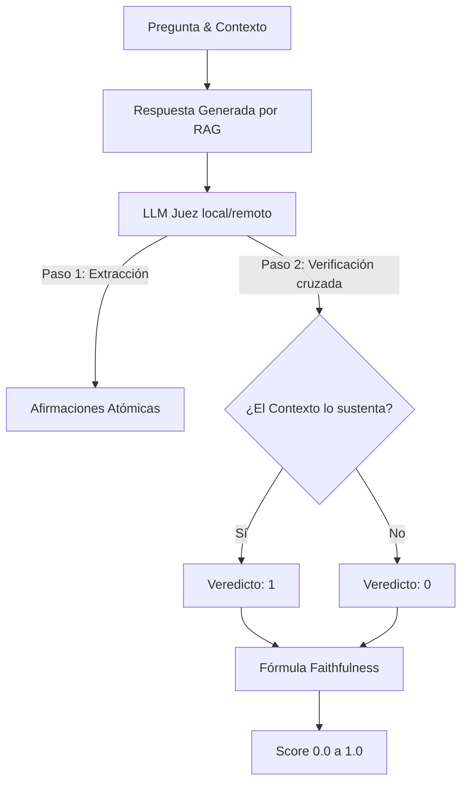
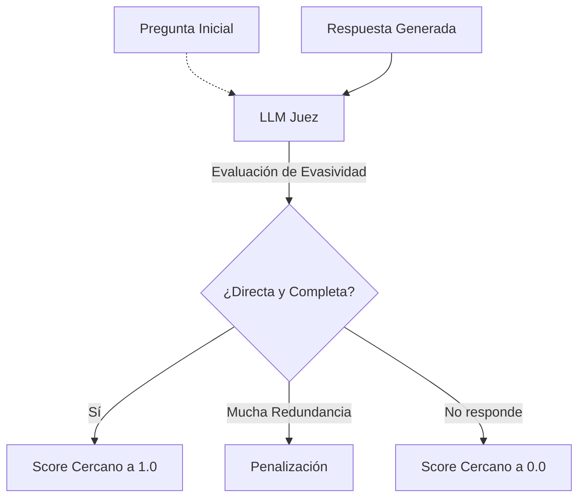
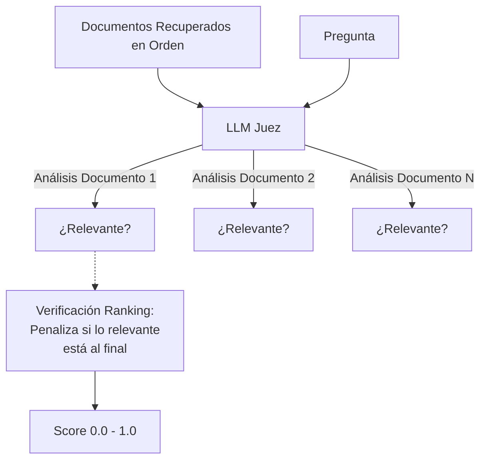

# Evaluación de Sistemas RAG: Métricas Implementadas y Sustento Científico

## 0. Introducción: ¿Por Qué Medir un Sistema RAG?

La evaluación de los sistemas de Generación Aumentada por Recuperación (RAG) es fundamental para garantizar su fiabilidad en aplicaciones del mundo real. Uno de los mayores desafíos técnicos en la adopción de los Modelos de Lenguaje Grande (LLMs, por sus siglas en inglés) es su propensión a generar información incorrecta o no verificable, un fenómeno comúnmente denominado "alucinación". 

A diferencia de la evaluación humana tradicional, que es costosa, lenta y difícil de escalar, la evaluación automatizada mediante el paradigma "LLM-as-a-Judge" permite realizar pruebas sistemáticas y reproducibles sobre pipelines completos. Sin embargo, no cualquier métrica de similitud textual es suficiente. Según Es et al. (2024), el framework RAGAS (Retrieval Augmented Generation Assessment) establece un estándar para esta evaluación al dividir el análisis en dos dimensiones críticas:
1. **El componente de Recuperación (Retrieval):** ¿El sistema logra encontrar la información correcta en la base de conocimientos?
2. **El componente de Generación (Generation):** ¿El LLM utiliza la información recuperada de manera fiel para responder la pregunta, sin inventar datos?

No obstante, depender exclusivamente de jueces automatizados conlleva riesgos. Según Zhou et al. (2026), los modelos evaluadores pueden exhibir sesgos algorítmicos (como preferencia por respuestas más largas o por contenido generado por ellos mismos). Por ello, este proyecto emplea un conjunto curado de 4 métricas, apoyadas en la literatura científica, estructurando prompts rígidamente formateados en JSON para forzar explicaciones paso a paso antes de emitir un veredicto definitivo.

---

## 1. Faithfulness (Fidelidad)

### 1.1 Definición y Necesidad
La métrica de Fidelidad (*Faithfulness*) mide qué tan apegada está la respuesta final al contexto proporcionado por el sistema de recuperación. Es la métrica central para la detección de alucinaciones en respuestas RAG, asegurando que ninguna afirmación hecha por el modelo haya sido inventada o inferida de su conocimiento previo.

### 1.2 Perspectivas Científicas
*   **A favor:** Según Es et al. (2024), *Faithfulness* calcula la proporción de afirmaciones atómicas («claims») en la respuesta que pueden inferirse lógicamente del contexto. Según Wu et al. (2024), el monitoreo continuo de esta fidelidad en tiempo real (*SynCheck*) es esencial para prevenir que el LLM se desvíe en tareas críticas. Asimismo, en la implementación de pequeños modelos, según Khalila et al. (2025), optimizar únicamente esta métrica garantiza fiabilidad incluso si el modelo base carece de conocimiento general amplio.
*   **Limitaciones:** Según Roychowdhury et al. (2024), en dominios técnicos específicos (como Telecomunicaciones), los jueces LLM que miden *Faithfulness* pueden fallar si el contexto requiere validación numérica estricta, siendo propensos a errores matemáticos básicos. Adicionalmente, según Zhou et al. (2026), los jueces LLM pueden sufrir sesgos al penalizar respuestas que están estructuradas de forma distinta al contexto, incluso si son factuales.

### 1.3 Cálculo Matemático
La métrica se calcula extrayendo primero una lista de afirmaciones atómicas de la respuesta generada. Luego, se verifica cada afirmación contra el contexto recuperado.

$$Faithfulness = \frac{|V|}{|A|}$$

Donde:
*   $|V|$ es el número de afirmaciones verificadas como sustentadas en el contexto.
*   $|A|$ es el número total de afirmaciones atómicas extraídas de la respuesta.

### 1.4 Implementación en el Proyecto
Métrica ubicada en `src/metrics/faithfulness.py`. Utiliza LangChain y nuestro `JudgeFactory` (`judges.py`). El LLM primero divide la respuesta (`answer`) en oraciones atómicas y, posteriormente, analiza cada oración contra los documentos (`context`). Retorna una estructura JSON con los campos `veredicto` (0 o 1) y `razón`.

### 1.5 Diagrama de Flujo

---

## 2. Answer Relevancy (Relevancia de la Respuesta)

### 2.1 Definición y Necesidad
Evalúa en qué medida la respuesta generada aborda directamente la pregunta original formulada por el usuario. Penaliza fuertemente las respuestas evasivas, incompletas o que divagan sobre temas redundantes, incluso si la información es factualmente correcta (fiel).

### 2.2 Perspectivas Científicas
*   **A favor:** "La métrica penaliza la información redundante y garantiza que las respuestas sean directas" (Es et al., 2024). Según Khalila et al. (2025), esta métrica es fundamental en aplicaciones donde las bases de datos contienen múltiples temáticas mezcladas y recuperar el documento correcto no implica necesariamente generar la respuesta esperada.
*   **Limitaciones:** Según Tan et al. (2024) en su trabajo *JudgeBench*, los evaluadores LLM muestran dificultades intrínsecas para juzgar la relevancia objetiva sin acceso a una "respuesta ideal" (*Ground Truth*), dependiendo excesivamente de la formulación lingüística de la pregunta.

### 2.3 Cálculo Matemático
Se basa en generar preguntas inversas a partir de la respuesta proporcionada y medir la similitud de los embeddings (coseno) entre la pregunta original y las artificialmente generadas.

$$Answer \ Relevancy = \frac{1}{N} \sum_{i=1}^{N} \cos(E_q, E_{g_i})$$

Donde:
*   $E_q$ es el embedding de la pregunta original.
*   $E_{g_i}$ son los embeddings de las preguntas generadas sintéticamente a partir de la respuesta.
*   $N$ es el número de intentos o formulaciones generadas.

### 2.4 Implementación en el Proyecto
Métrica ubicada en `src/metrics/answer_relevancy.py`. Utilizamos el Juez LLM configurado para emitir una calificación de 0.0 a 1.0 mediante ingeniería de *prompts*, solicitando explicaciones de por qué la respuesta incluye divagaciones o si va directamente al punto, simplificando el uso costoso de embeddings para este análisis heurístico iterativo.

### 2.5 Diagrama de Flujo

---

## 3. Context Precision (Precisión del Contexto)

### 3.1 Definición y Necesidad
Es una métrica centrada en el *ranking* (ordenación) del sistema de recuperación. Evalúa si todos los documentos relevantes encontrados están posicionados en las primeras posiciones (puestos altos) de los resultados del *retriever*, independientemente del número total de documentos irrelevantes que también se presenten.

### 3.2 Perspectivas Científicas
*   **A favor:** Según Es et al. (2024), un contexto más concentrado en los valores iniciales mejora drásticamente el desempeño contextual (in-context learning) del generador LLM final. Según Tang & Yang (2024) en *MultiHop-RAG*, la precisión del ranking es el principal factor limitante a la hora de resolver preguntas que requieren la conexión de múltiples documentos distintos.
*   **Limitaciones:** Según Roychowdhury et al. (2024), en corpus pequeños o extremadamente homogéneos, evaluar el *ranking* tiene un impacto marginal comparado a simplemente inyectar todos los contextos recuperados al LLM cuando estos caben holgadamente en su ventana de tokens.

### 3.3 Cálculo Matemático
Utiliza el promedio de las precisiones (Average Precision - AP) a lo largo de las $K$ posiciones:

$$Context \ Precision@K = \frac{\sum_{k=1}^{K} (Precision@k \times v_k)}{\text{número de ítems relevantes top K}}$$

Donde $v_k$ es un indicador binario de relevancia en el rango $k$.

### 3.4 Implementación en el Proyecto
Ubicada en `src/metrics/context_precision.py`. El juez toma la pregunta, los contextos y la respuesta esperada (si la hay) y determina si el bloque de texto aportó valor, calculando luego el puntaje considerando la lista de bloques priorizados recuperados por *Qdrant* (o la base de datos).

### 3.5 Diagrama de Flujo

---

## 4. Context Relevance (Relevancia del Contexto)

### 4.1 Definición y Necesidad
A diferencia de *Context Precision* (que evalúa el orden), *Context Relevance* es una métrica de filtro de ruido estricta: mide la proporción de oraciones o fragmentos dentro del bloque de contexto recuperado que son verdaderamente necesarios para responder la pregunta, excluyendo toda información redundante.

### 4.2 Perspectivas Científicas
*   **A favor:** Eliminar ruido no relevante evita que los modelos "alucinen" apoyándose en datos colaterales falsos. Reducir el contexto irrelevante disminuye los costos computacionales y monetarios (Es et al., 2024). Según Khalila et al. (2025), asegurar contextos estancos incrementa la controlabilidad temática.
*   **Limitaciones:** El costo del "LLM-as-a-Judge" para evaluar oración por oración un contexto extenso suele ser económicamente inviable para despliegues a gran escala, limitándolo generalmente a etapas de optimización y benchmark (Roychowdhury et al., 2024).

### 4.3 Cálculo Matemático

$$Context \ Relevance = \frac{|S|}{Total \ de \ oraciones \ recuperadas}$$

Donde $|S|$ representa la cantidad de oraciones que el evaluador selecciona como esenciales para resolver la duda propuesta por el usuario.

### 4.4 Implementación en el Proyecto
Codificada en `src/metrics/context_relevance.py`. Por motivos de eficiencia algorítmica y gestión de ventanas de contexto, empleamos un acercamiento global aproximado en lugar de la partición oración-por-oración original, permitiendo escalabilidad en este TFM.

### 4.5 Diagrama de Flujo

---

## 5. Métrica Descartada: FactScore

### 5.1 Justificación Científica y Técnica
La métrica **FActScore** (Min et al., 2023) fue originalmente diseñada para validar información factual en tareas de texto generativo libre (sin RAG), cruzando afirmaciones atómicas contra un motor de Wikipedia subyacente. Durante la fase de desarrollo, esta métrica se consideró y codificó inicialmente. 

Sin embargo, el equipo la descartó del *pipeline* final basándose en dos vectores principales:
1. **Redundancia Conceptual:** Dado que nuestro RAG confía su validez al dominio cerrado inyectado en *Context*, la métrica *Faithfulness* realiza el cruce atómico directamente contra la matriz recuperada, anulando la necesidad de buscar una validez ontológica externa (Wikipedia/FactScore).
2. **Inestabilidad del Evaluador:** La arquitectura de JSON estricto en el iterador `JudgeFactory` introducía problemas de decodificación masiva ante la doble deconstrucción anidada (Oración -> Afirmación Factual -> Verificación). El sistema arrojaba constantemente **0.0**, forzando su desactivación y alineándonos pragmáticamente al marco universal de RAGAS de 4 pilares.

---

## 6. Tabla Comparativa de Referencias por Métrica

| Métrica Asociada | Título del Artículo | Autores | Año | DOI / Identificador | Rol en el Proyecto (Defiende/Critica) |
| :--- | :--- | :--- | :--- | :--- | :--- |
| **Todas (Base)** | RAGAs: Automated Evaluation of RAG | Es, James et al. | 2024 | 10.18653/v1/2024.eacl-demo.16 | Defiende como marco fundacional. |
| **Faithfulness** | SynCheck: Synchronous Faithfulness Monitoring | Wu, Gu et al. | 2024 | arXiv:2406.13692 | Defiende el monitoreo síncrono. |
| **Answer Rel / Ctx Rel** | Investigating RAG in Quranic Studies | Khalila, Nasution et al. | 2025 | arXiv:2503.16581 | Defiende aplicaciones en RAG y QA de dominio estricto. |
| **Context Pr.** | MultiHop-RAG: Benchmarking RAG Multi-Hop | Tang & Yang | 2024 | arXiv:2401.15391 | Defiende la importancia de precision@k en contextos complejos. |
| **Todas (Crítica)** | Evaluation of RAG Metrics for QA in Telecom | Roychowdhury et al. | 2024 | arXiv:2407.12873 | Critica limitaciones en lógica matemática y corpus reducidos. |
| **Metodología Juez** | LLMs-as-Judges: A Comprehensive Survey | Li, Dong et al. | 2024 | arXiv:2412.05579 | Muestra el estado del arte y uso de evaluadores LLM. |
| **Metodología Juez** | JudgeBiasBench: Taxonomic Bias Evaluation | Zhou, Huang et al. | 2026 | arXiv:2603.08091 | Critica los sesgos metodológicos de los LLM (posición, longitud). |
| **Metodología Juez** | JudgeBench: Evaluating LLM-based Judges | Tan, Zhuang et al. | 2024 | arXiv:2410.12784 | Critica el desempeño en evaluación sin ground truth estricta. |
| **FactScore** | FActScore: Fine-grained Atomic Evaluation | Min, Krishna et al. | 2023 | 10.18653/v1/2023.emnlp-main.741 | Justifica originalmente la extracción atómica (ahora descartada). |

---

## 7. Metodología de Benchmarking entre Modelos

Este proyecto utiliza el script `eval/run_matrix_eval.py` para comparar el desempeño de configuraciones RAG a un nivel sistémico. Inspirado en metodologías de validación masiva propuestas en la literatura algorítmica, nuestro benchmarking se fundamenta en las siguientes directrices:

1. **Variables Independientes (Matriz de Componentes):**
   *   Modelos de Embeddings (Ej. *nomic-embed-text* vs *BGE*).
   *   Estrategias de Segmentación / Chunking (Ej. Recursive Character Splitter, Semantic Splitter).
   *   Modelos de Generación Final (Ej. *llama3*, *deepseek-r1*, *gemma2*).
2. **Validación Estadística (Kruskal-Wallis y Mann-Whitney U):** Siguiendo directrices convencionales, no confiamos iteraciones únicas debido al alto grado de aleatoriedad del LLM generador. El procesamiento demanda mínimo 32 consultas (Gasto Estadístico Válido) extraídas de un banco de preguntas estandarizado (*Golden Dataset*) con respuestas correctas esperadas.
3. **Plasmado Gráfico:** Se generarán gráficos Radiales (*Radar Plots*) para cruzar de un vistazo visual las 4 métricas base y poder discernir con el usuario final qué trade-off técnico prefiere realizar.

---

## 8. Tabla de Artículos Científicos de Descarga

> [!TIP]
> Acceda de forma directa a los repositorios documentales PDF empleados en la redacción de este marco evaluativo:

| # | Título | Autores | Año | DOI / arXiv | Link Descarga |
| :-- | :-- | :-- | :-- | :-- | :-- |
| 1 | RAGAs: Automated Evaluation of RAG | Es, James, Espinosa-Anke, Schockaert | 2024 | `10.18653/v1/2024.eacl-demo.16` | [PDF](https://arxiv.org/pdf/2309.15217v2) |
| 2 | FActScore: Fine-grained Atomic Evaluation | Min, Krishna, Lyu et al. | 2023 | `10.18653/v1/2023.emnlp-main.741` | [PDF](https://arxiv.org/pdf/2305.14251) |
| 3 | Evaluation of RAG Metrics for QA in Telecom | Roychowdhury, Soman et al. | 2024 | `arXiv:2407.12873` | [PDF](https://arxiv.org/pdf/2407.12873v1) |
| 4 | LLMs-as-Judges: A Comprehensive Survey | Li, Dong, Chen et al. | 2024 | `arXiv:2412.05579` | [PDF](https://arxiv.org/pdf/2412.05579v2) |
| 5 | JudgeBiasBench: Taxonomic Bias Evaluation | Zhou, Huang, Zhang et al. | 2026 | `arXiv:2603.08091` | [PDF](https://arxiv.org/pdf/2603.08091v1) |
| 6 | SynCheck: Synchronous Faithfulness Monitoring | Wu, Gu, Yin, Peng, Chang | 2024 | `arXiv:2406.13692` | [PDF](https://arxiv.org/pdf/2406.13692v2) |
| 7 | Investigating RAG in Quranic Studies | Khalila, Nasution et al. | 2025 | `arXiv:2503.16581` | [PDF](https://arxiv.org/pdf/2503.16581v1) |
| 8 | MultiHop-RAG: Benchmarking RAG Multi-Hop | Tang, Yang | 2024 | `arXiv:2401.15391` | [PDF](https://arxiv.org/pdf/2401.15391v1) |
| 9 | JudgeBench: Evaluating LLM-based Judges | Tan, Zhuang et al. | 2024 | `arXiv:2410.12784` | [PDF](https://arxiv.org/pdf/2410.12784v2) |

---

## 9. Referencias Bibliográficas

Es, S., James, J., Espinosa-Anke, L., & Schockaert, S. (2024). RAGAs: Automated Evaluation of Retrieval Augmented Generation. _Proceedings of the 18th Conference of the European Chapter of the Association for Computational Linguistics: System Demonstrations_, 150–158. https://doi.org/10.18653/v1/2024.eacl-demo.16

Khalila, I., Nasution, M. K. M., Noah, S. A., Taufik, N., Yusup, N. A. M., Ardiansyah, P. L., Haswan, F., & Elfitri, I. (2025). _Investigating Large Language Models Retrieval-Augmented Generation in Quranic Studies_. arXiv preprint arXiv:2503.16581. https://arxiv.org/abs/2503.16581

Li, H., Dong, Y., Chen, Z., et al. (2024). _LLMs-as-Judges: A Comprehensive Survey on LLM-based Evaluation Methods_. arXiv preprint arXiv:2412.05579. https://arxiv.org/abs/2412.05579

Min, S., Krishna, K., Lyu, X., Lewis, M., Yih, W., Koh, P. W., Iyyer, M., Zettlemoyer, L., & Hajishirzi, H. (2023). FActScore: Fine-grained Atomic Evaluation of Factual Precision in Long Form Text Generation. _Proceedings of the 2023 Conference on Empirical Methods in Natural Language Processing_, 12076–12100. https://doi.org/10.18653/v1/2023.emnlp-main.741

Roychowdhury, S., Soman, S., et al. (2024). _Evaluation of Retrieval-Augmented Generation Metrics for Question Answering in the Telecom Domain_. arXiv preprint arXiv:2407.12873. https://arxiv.org/abs/2407.12873

Tan, Q., Zhuang, Y., et al. (2024). _JudgeBench: A Benchmark for Evaluating LLM-based Judges_. arXiv preprint arXiv:2410.12784. https://arxiv.org/abs/2410.12784

Tang, Y. & Yang, W. (2024). _MultiHop-RAG: Benchmarking Retrieval-Augmented Generation for Multi-Hop Queries_. arXiv preprint arXiv:2401.15391. https://arxiv.org/abs/2401.15391

Wu, Y., Gu, J., Yin, R., Peng, H., & Chang, K.-W. (2024). _SynCheck: Synchronous Faithfulness Monitoring for Language Models_. arXiv preprint arXiv:2406.13692. https://arxiv.org/abs/2406.13692

Zhou, Y., Huang, R., Zhang, S., et al. (2026). _JudgeBiasBench: Taxonomic Bias Evaluation of Large Language Models as Judges_. arXiv preprint arXiv:2603.08091. https://arxiv.org/abs/2603.08091
