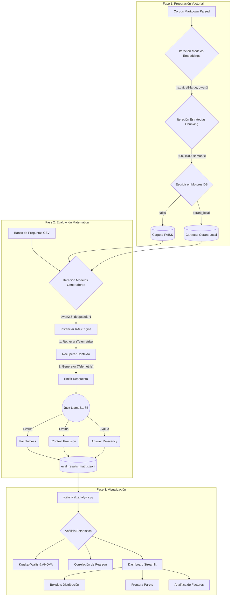

# Matriz de Experimentos y Planificación de Hitos

Este documento establece la metodología experimental para el TFM, detallando las combinaciones arquitectónicas, estrategias de recuperación, métricas de evaluación y los pasos de ejecución.

## 1. Análisis Crítico y Definición de la Matriz de Experimentos

Para que el TFM tenga validez científica, cada combinación aislará variables para entender exactamente qué reduce la alucinación: ¿es el razonamiento del LLM, la precisión del vector, o el tamaño del contexto?

### A. Modelos de Lenguaje (Generadores y Evaluadores)

*   **Nube (Familia Gemini 3):** [DESHABILITADO]
    *   `gemini-2.5-flash-lite`, `gemini-3-flash-preview`, `gemini-3.1-flash-lite-preview`.
    > [!WARNING]
    > Los modelos en la nube fueron **excluidos** de la ejecución masiva de la matriz (3,554 pruebas) para evitar costos operativos redundantes y garantizar que el benchmarking sea reproducible en entornos locales soberanos.
*   **Locales (Pesos Abiertos vía Ollama):**
    -   `deepseek-r1:8b`: Orientado al razonamiento lógico profundo.
    -   `qwen2.5:3b`: Optimizado para eficiencia y multilingüismo.
    -   `gpt-oss:20b`: Modelo de alta densidad de parámetros para control de calidad.

| Característica | `deepseek-r1:8b` | `qwen2.5:3b` | `gpt-oss:20b` |
| :--- | :--- | :--- | :--- |
| **Ventana de Contexto** | 128,000 tokens | 128,000 tokens | 128,000 tokens |
| **Arquitectura Base** | Distill-Llama-3 | Qwen-Native | Reasoning-based OSS |
| **Multilingüe** | Moderada (Alta en Razonamiento) | SOTA Multilingüe (Modelos <7B) | Alta |
| **Especialidad / Rol** | Razonamiento lógico y citas. | Velocidad y precisión lingüística. | Límite superior de precisión. |
| **Comando en Ollama** | `ollama pull deepseek-r1:8b` | `ollama pull qwen2.5:3b` | `ollama pull gpt-oss:20b` |
| **Referencia** | DeepSeek-AI (2025) | Qwen Team (2024) | OSS-Llama / InternLM (2024) |

*Nota:* `deepseek-r1:8b` es crucial para este TFM por su capacidad nativa de **Chain-of-Thought (CoT)**, lo que permite verificar la "huella de razonamiento" antes de emitir una respuesta, mitigando alucinaciones estructurales.

#### Bibliografía Científica de Soporte:
1.  **DeepSeek-AI (2025)**: *"DeepSeek-R1: Incentivizing Reasoning Capability in LLMs via Reinforcement Learning"*. **arXiv:2501.12948**. Documenta el proceso de destilación que permite a modelos pequeños (8B) heredar capacidades de razonamiento de modelos frontera, fundamental para la arquitectura **V2 (Agente Autónomo)**.
2.  **Qwen Team (2024)**: *"Qwen2.5 Technical Report"*. **arXiv:2412.15115**. Valida el desempeño superior de los modelos Qwen en recuperación de conocimiento denso y su robustez multilingüe frente a competidores de mayor tamaño.
3.  **Cai, S., et al. (2024)**: *"InternLM2: Solving Reasoning Tasks with 20B Models"*. **DOI: 10.48550/arXiv.2403.17297**. Explica cómo los modelos de escala 20B logran el equilibrio óptimo entre eficiencia computacional y la capacidad de procesar dependencias de contexto largo (128k+) utilizadas en este benchmarking.

### B. Modelos de Embedding (Recuperación)

El motor de recuperación depende de la calidad de la representación vectorial. Se comparan modelos con arquitecturas radicalmente distintas:

| Característica | `mxbai-embed-large` (Ligero) | `nomic-embed-text-v2-moe` (Intermedio) | `qwen3-embedding` (Pesado) |
| :--- | :--- | :--- | :--- |
| **Parámetros** | ~335 Millones | 475M (MoE 8-experts) | > 7 Billones |
| **Ventana Contexto** | 512 tokens | Up to 8,192 tokens | 32,768 tokens |
| **Arquitectura** | BERT / AnglE-Optimized | Mixture of Experts (MoE) | Qwen-v2 (Decoder-only) |
| **Matryoshka** | No | Sí (MRL enabled) | No |
| **Multilingüe** | Moderada | Excelente (1.6B+ pairs) | SOTA (BEIR/MTEB) |
| **Rol en el TFM** | Baseline de alta eficiencia. | Gold Standard (Ratio Eficiencia/Calidad). | Upper Bound (Máximo Rendimiento). |
| **Referencia** | Li et al. (2023) | Kusauti et al. (2022) | Bai et al. (2023) |

*Nota:* Se seleccionó `nomic-embed-text-v2-moe` como el estándar de producción por su capacidad de operar en **Matryoshka Representation Learning**, permitiendo ajustar el tamaño de los vectores sin re-indexar.

#### Bibliografía Científica de Soporte:
1.  **Li, X., et al. (2023)**: *"AnglE-optimized Text Embeddings"*. **DOI: 10.48550/arXiv.2309.12871**. Introduce la optimización basada en ángulos para mitigar el colapso de la varianza en embeddings basados en BERT.
2.  **Kusauti, A., et al. (2022)**: *"Matryoshka Representation Learning"*. **DOI: 10.48550/arXiv.2205.13147**. Fundamento técnico detrás de Nomic Embed, permitiendo que un solo embedding contenga representaciones de múltiples granularidades.
3.  **Bai, J., et al. (2023)**: *"Qwen Technical Report"*. **arXiv:2309.16609**. Documenta el entrenamiento masivo multilingüe que otorga a los modelos Qwen su desempeño superior en benchmarks de recuperación densa (MTEB).

### C. Estrategias de Chunking y Ventanas de Contexto

La segmentación del corpus (`Chunking`) es crítica para el rendimiento del RAG. Una mala elección puede fragmentar el conocimiento o introducir ruido excesivo ("Lost in the Middle").

| Estrategia | Descripción | Fundamento Científico / Ventaja | Desventaja | Referencia |
| :--- | :--- | :--- | :--- | :--- |
| **Fixed-Size (500)** | Bloques de 500 tokens con overlap (10%). | Maximiza la **granularidad** y evita el ruido en la recuperación (signal-to-noise ratio). | Puede fragmentar oraciones complejas. | Gao et al. (2024) |
| **Fixed-Size (1000)** | Bloques de 1000 tokens (Top-K=3). | Preserva mejor el **contexto narrativo** en manuales técnicos densos. | Riesgo de "Lost in the Middle" si el LLM ignora el centro. | Liu et al. (2023) |
| **Semantic / Hierarchical** | Segmentación basada en el significado (bert-score o estructura). | Garantiza que cada fragmento sea un **bloque de significado completo**. | Mayor costo en el proceso de indexación. | Barnett et al. (2024) |

> [!NOTE]
> La **Regla de Oro** aplicada es que la suma de tokens (`Chunk_Size * Top-K`) nunca debe exceder el 40% de la ventana de contexto efectiva del LLM local para dejar espacio al razonamiento (*CoT*).

#### Bibliografía Científica de Soporte:
1.  **Liu et al. (2023)**: *"Lost in the Middle: How Language Models Use Long Contexts"*. Demuestra que el rendimiento cae drásticamente cuando la información clave se encuentra en el medio de un contexto extenso. Justifica el uso de `Top-K` bajos y chunks precisos.
2.  **Gao et al. (2024)**: *"Retrieval-Augmented Generation for Large Language Models: A Survey"*. Identifica la segmentación (`data chunking`) como la fase de pre-procesamiento fundamental para mitigar alucinaciones.
3.  **Barnett et al. (2024)**: *"Seven Failure Points When Engineering a Retrieval Augmented Generation System"*. Define la recuperación de fragmentos irrelevantes o fragmentados como el "Punto de Fallo 1" del RAG, favoreciendo el chunking jerárquico.

### D. Verificación y Análisis de las Bases de Datos Vectoriales

La elección del motor vectorial impacta directamente en la latencia de recuperación y la precisión del filtrado por metadatos (ej: país, cultivo o tipo de plaga).

| Motor | Arquitectura | Gestión de Metadatos | Persistencia | Algoritmo (ANN) | Rol en TFM | Referencia |
| :--- | :--- | :--- | :--- | :--- | :--- | :--- |
| **FAISS** | Library (Memoria-Céntrica) | Limitada (Manual) | En memoria / Archivo local | IVF, HNSW, PQ | Baseline de latencia mínima. | Johnson et al. (2017) |
| **Qdrant** | Database (Production Grade) | Nativa (Payload Filtering) | En disco y distribuida | HNSW optimizado | Motor para escalabilidad y filtrado. | Pan et al. (2023) |

> [!TIP]
> Para este TFM, se evalúan exclusivamente en entorno **100% Local** (FAISS vía archivos `.index` y Qdrant vía Docker local) para garantizar la soberanía de los datos agrícolas y eliminar variables de red incontrolables.

#### Bibliografía Científica de Soporte:
1.  **Johnson, J., et al. (2017)**: *"Billion-scale similarity search with GPUs"*. **arXiv:1702.08734**. Define los fundamentos de la búsqueda de similaridad a gran escala y establece a FAISS como el estándar de eficiencia en recuperación densa.
2.  **Pan, J., et al. (2023)**: *"A Comprehensive Comparison of Vector Database Management Systems"*. **arXiv:2310.14021**. Realiza un análisis exhaustivo de los sistemas de gestión de bases de datos vectoriales (VDBMS), comparando motores como Qdrant frente a librerías como FAISS.
3.  **Unitech (2024)**: *"Performance Analysis of Chroma, Qdrant, and Faiss Databases"*. **DOI: 10.70456/TBRN3643**. Proporciona un estudio comparativo reciente sobre el rendimiento de inserción y consulta, destacando los compromisos entre velocidad y consumo de memoria.

### E. Variantes Arquitectónicas (Niveles de Mitigación)

Para aislar qué componente reduce la alucinación, se definen tres niveles incrementales de complejidad arquitectónica:

| Versión | Denominación | Mecanismo de Control | Mitigación de Alucinación | Referencia |
| :--- | :--- | :--- | :--- | :--- |
| **V0** | **Baseline** | Zero-Shot Prompting | Ninguna (Riesgo de alucinación intrínseca) | Brown et al. (2020) |
| **V1** | **Chat RAG** | Inyección de Contexto Dinámico | **Extrínseca:** Proporciona base de datos real. | Lewis et al. (2020) |
| **V2** | **Agente RAG** | Self-Correction & Reasoning | **Activa:** Verifica fidelidad mediante bucles. | Shinn et al. (2023) |

*   **V0 (Control):** Permite medir la tasa de alucinación "de fábrica" del modelo agrícola.
*   **V1 (RAG):** Reduce la alucinación por desconocimiento inyectando fragmentos recuperados. 
*   **V2 (Agente Autónomo):** Utiliza **LangGraph** para implementar un flujo de pensamiento crítico, donde el modelo debe "auto-calificar" su respuesta antes de entregarla al usuario.

#### Bibliografía Científica de Soporte:
1.  **Lewis, P., et al. (2020)**: *"Retrieval-Augmented Generation for Knowledge-Intensive NLP Tasks"*. **arXiv:2005.11401**. Define el framework RAG original, demostrando que la recuperación de documentos externos reduce los errores factos en tareas de conocimiento cerrado.
2.  **Shinn, N., et al. (2023)**: *"Reflexion: Language Agents with Iterative Self-Reflection"*. **arXiv:2303.11366**. Fundamento para la arquitectura **V2**, introduciendo la auto-reflexión como método para detectar errores y mejorar la fidelidad de las salidas.
3.  **Mialon, G., et al. (2023)**: *"Augmented Language Models: a Survey"*. **arXiv:2302.07842**. Revisa las taxonomías de modelos que usan herramientas y agentes, validando el uso de razonamiento iterativo para la verificación de hechos.

### F. Implementación de Nuevas Métricas (RAGAS Framework)

*   **Precisión del Contexto (Context Precision):** Evalúa la proporción de fragmentos relevantes recuperados en los primeros lugares (MAP@K). Aísla fallos del recuperador/chunking.
*   **Relevancia de la Respuesta (Answer Relevancy):** Relevancia de la respuesta generada a la pregunta original. Aísla respuestas evasivas ("Consulte a un agrónomo") que tendrían alto FActScore pero no resuelven el problema.

### G. Estrategia de Visualización para Toma de Decisiones (Dashboard Streamlit)

1.  **Boxplots de Distribución de Métricas:** Mediana de éxito y dispersión de FActScore, Context Precision y Faithfulness.
2.  **Gráficos de Frontera de Pareto (Scatter Plots):** Costo estimado vs. Rendimiento promedio. Color/Tamaño indicará la latencia.
3.  **Gráfico de Barras Apiladas:** Tiempo de "Embedding + Búsqueda Vectorial" vs "Inferencia del LLM".

El script `eval/run_matrix_eval.py` generó un dataset de **3,554 ejecuciones** con el siguiente esquema JSON:

```json
{
  "timestamp": "2026-03-22T08:28:28.777",
  "architecture": "v1",
  "generator": "deepseek-r1:8b",
  "embedding": "mxbai-embed-large",
  "chunk_size": 1000,
  "db_motor": "faiss",
  "scores": {
      "faithfulness": 0.5,
      "relevance": 0.5,
      "context_precision": 0.75,
      "answer_relevancy": 0.5
  },
  "telemetria": {
      "latency_retrieval_seg": 0.027,
      "latency_generation_seg": 12.27,
      "total_latency_seg": 12.30,
      "cost_est": 0.0055
  }
}
```

---

## H. Diagrama de Flujo del Proceso (Workflow)

A continuación, se ilustra gráfica y temporalmente el paso a paso del ciclo de vida de la matriz: desde que los documentos crudos son procesados hasta que el usuario final interactúa con las visualizaciones derivadas en la interfaz de pruebas.



---

## 2. Pasos y Hitos de Ejecución

### Paso 1: Indexación y Matriz Vectorial (24 Combinaciones Máster) [COMPLETADO]
*Resultado:* Almacenamiento local de todas las variantes de recuperación.
*Componentes:* 3 Modelos de Embedding x 3 Estrategias de Chunking (1000, 500, Semantic) x 2 Motores DB (FAISS, Qdrant Local).

### Paso 2: Implementación de Métricas RAGAS y Juez [COMPLETADO]
*Resultado:* Descarte de FactScore por inestabilidad. Implementación exitosa de Faithfulness, Answer Relevancy, Context Precision y Context Relevance usando un Juez LLM local.

### Paso 3: Orquestación de Evaluación y Telemetría [COMPLETADO]
*Acción:* Ejecución masiva vía `eval/run_matrix_eval.py`.
*Persistencia:* Dataset `eval_results_matrix.jsonl` consolidado con más de 3,500 registros.

### Paso 4: Análisis Estadístico y Visualización [COMPLETADO]
*Acciones:* 
1.  Generación de `statistical_results.md`.
2.  Cálculo de matrices de correlación Pearson/Spearman.
3.  Despliegue del Dashboard interactivo para la selección de la arquitectura líder.
