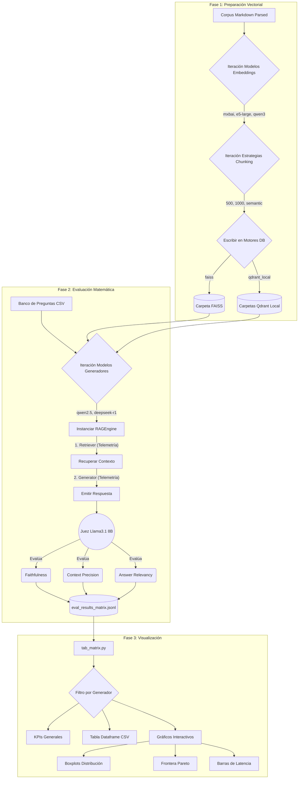

# Matriz de Experimentos y Planificación de Hitos

Este documento establece la metodología experimental para el TFM, detallando las combinaciones arquitectónicas, estrategias de recuperación, métricas de evaluación y los pasos de ejecución.

## 1. Análisis Crítico y Definición de la Matriz de Experimentos

Para que el TFM tenga validez científica, cada combinación aislará variables para entender exactamente qué reduce la alucinación: ¿es el razonamiento del LLM, la precisión del vector, o el tamaño del contexto?

### A. Modelos de Lenguaje (Generadores y Evaluadores)

*   **Nube (Familia Gemini 3):**
    *   `gemini-3.1-pro-preview`: Modelo "pensador" pesado. Alto razonamiento lógico, ideal para inferencias agronómicas complejas.
    *   `gemini-3-flash-preview`: Modelo rápido y balanceado.
    *   `gemini-3.1-flash-lite-preview`: Modelo ultraligero. Útil para medir si arquitecturas RAG perfectas compensan a un modelo generativo débil.
*   **Locales (Pesos Abiertos vía Ollama):**
    *   `deepseek-r1:8b`: Destaca por su arquitectura orientada al razonamiento profundo (MoE/Distill).
    *   `qwen3`: (Versiones 7B o 14B) Estado del arte en multilingüismo.
    *   `gpt-oss:20b`: (Representando un modelo de 20B). *Nota de Hardware:* Requerirá al menos 12-16GB de VRAM en cuantización de 4-bits.

### B. Modelos de Embedding (Recuperación)

Usar modelos locales permite la reproducibilidad sin costos de API recurrentes.

| Característica | `mxbai-embed-large` (Ligero) | `nomic-embed-text-v2-moe` (Intermedio) | `qwen3-embedding` (Pesado) |
| :--- | :--- | :--- | :--- |
| **Parámetros** | ~335 Millones | 475M (305M activos MoE) | > 7 Billones |
| **Ventana de Contexto Max** | 512 tokens | 512 tokens | Hasta 32,768 tokens |
| **Arquitectura Base** | BERT / AnglE-Optimized | Mixture of Experts (MoE, 8 exp) | Qwen (Decoder-only) |
| **Capacidad Multilingüe**| Moderada (Principalmente Inglés) | Excelente (~100 idiomas, 1.6B+ pairs)| SOTA Absoluto (Dominio Nativo) |
| **Tolerancia a Edge Cases**| Alta | Muy Alta (Previene NaNs algebraicos) | Alta (Arquitectura LLM completa) |
| **Rol en el TFM** | Baseline de eficiencia y velocidad. | Gold Standard para recuperación multilingüe. | Límite superior (Upper Bound) científico. |
| **Comando en Ollama** | `ollama pull mxbai-embed-large` | `ollama pull nomic-embed-text-v2-moe` | `ollama pull qwen` (adaptado) |

*Nota:* `nomic-embed-text-v2-moe` es el modelo seleccionado por ofrecer SOTA en recuperación multilingüe operando 100% libre de colapsos numéricos (`NaN`) en Ollama.

### C. Estrategias de Chunking y Ventanas de Contexto

**Regla de oro:** La suma de los tokens recuperados no debe exceder la ventana de contexto efectiva del LLM local.

*   **Límites de Contexto:** Gemini \> 1-2M tokens. Modelos locales (Ollama) \~8,192 a 32,768 tokens.
*   **Ajuste del parámetro `Top-K`:**
    1.  **Chunk de 500 tokens:** Recuperar `Top-K = 5` (\~2,500 tokens). Deja espacio para *Chain of Thought*.
    2.  **Chunk de 1000 tokens:** Recuperar `Top-K = 3` (\~3,000 tokens). Evita el fenómeno *Lost in the Middle*.
    3.  **Semantic / Hierarchical Chunking:** Límite estricto de recuperación total (ej. máximo 3,500 tokens en total) en lugar de un `Top-K` fijo.

### D. Verificación y Análisis de las Bases de Datos Vectoriales

*   **FAISS (Local - In-Memory):** Latencia ultrabaja (microsegundos). Desventaja: limitación en filtrado híbrido por metadatos.
*   **Qdrant (Local - Docker):** Excelente manejo de payloads para filtrado por metadatos con latencia de red insignificante.
*   **Qdrant (Cloud / SaaS):** Introducirá latencia de red que afectará el *Time-to-First-Token*.

*Resolución:* Medir tiempo exacto de `retriever.invoke()` aislado del tiempo de generación del LLM para justificar si la sobrecarga de Qdrant Cloud vale la pena frente a FAISS o Qdrant local.

### E. Implementación de Nuevas Métricas (RAGAS Framework)

*   **Precisión del Contexto (Context Precision):** Evalúa la proporción de fragmentos relevantes recuperados en los primeros lugares (MAP@K). Aísla fallos del recuperador/chunking.
*   **Relevancia de la Respuesta (Answer Relevancy):** Relevancia de la respuesta generada a la pregunta original. Aísla respuestas evasivas ("Consulte a un agrónomo") que tendrían alto FActScore pero no resuelven el problema.

### F. Estrategia de Visualización para Toma de Decisiones (Dashboard Streamlit)

1.  **Boxplots de Distribución de Métricas:** Mediana de éxito y dispersión de FActScore, Context Precision y Faithfulness.
2.  **Gráficos de Frontera de Pareto (Scatter Plots):** Costo estimado vs. Rendimiento promedio. Color/Tamaño indicará la latencia.
3.  **Gráfico de Barras Apiladas:** Tiempo de "Embedding + Búsqueda Vectorial" vs "Inferencia del LLM".

### G. Orquestación del Pipeline de Recopilación de Datos

El script `eval/run_matrix_eval.py` retornará diccionarios exhaustivos por ejecución:

```json
{
  "arquitectura": "V1",
  "llm_generador": "gemini-3.1-flash-lite",
  "llm_evaluador": "gemini-3.1-pro",
  "vector_db": "faiss_local",
  "embedding_model": "qllama/multilingual-e5-large",
  "chunk_size": 500,
  "metricas": {
      "faithfulness": 0.95,
      "fact_score": 0.98,
      "context_precision": 0.88,
      "answer_relevancy": 0.92
  },
  "telemetria": {
      "latency_retrieval_seg": 0.015,
      "latency_generation_seg": 1.25,
      "tokens_prompt": 1250,
      "tokens_completion": 300,
      "costo_estimado_usd": 0.00015
  }
}
```

---

## H. Diagrama de Flujo del Proceso (Workflow)

A continuación, se ilustra gráfica y temporalmente el paso a paso del ciclo de vida de la matriz: desde que los documentos crudos son procesados hasta que el usuario final interactúa con las visualizaciones derivadas en la interfaz de pruebas.



---

## 2. Pasos y Hitos de Ejecución

### Paso 1: Indexación y Generación de la Matriz Vectorial (27 Combinaciones)

*Objetivo:* Pre-calcular y almacenar todas las variantes de recuperación.
*Acción:* `scripts/build_vector_matrix.py` iterará sobre:
*   3 Modelos de Embedding
*   3 Estrategias de Chunking
*   3 Motores de DB (qdrant-local, qdrant-cloud, faiss)
*Nomenclatura:* `{tipo_modelo_embedding}_{chunking}_{nombre_DB_vectorial}`
*Persistencia:* FAISS guardado en `data/vector_matrix/`.

### Paso 2: Implementación de Nuevas Métricas y Juez Evaluador

*Objetivo:* Eliminar sesgo de auto-evaluación usando un modelo juez distinto (ej. Prometheus-2 o Llama-3-8B-Instruct).
*Métricas a implementar:* Context Precision y Answer Relevancy (RAGAS).

### Paso 3: Orquestación de Evaluación, Telemetría y Guardado Incremental

*Objetivo:* Ejecutar evaluaciones robustas tolerantes a fallos.
*Acción:* `eval/run_matrix_eval.py` (o similar) con argumentos CLI `--db`, `--arch`, `--models`.
*Telemetría por arquitectura:*
*   **V0:** `time_llm_generation`
*   **V1:** `time_vector_retrieval`, `time_llm_generation`, `total_time`
*   **V2:** `time_vector_retrieval`, `time_reflection_loops`, `total_iterations`, `time_llm_generation`, `total_time`
*Persistencia incremental:* `eval_results_matrix.jsonl` (Append por respuesta).

### Paso 4: Visualización Analítica mediante Dashboard Streamlit

*Objetivo:* Pestaña interactiva para toma de decisiones.
*Acciones en `src/ui/app.py` o módulo equivalente:*
1.  Comparativa de Arquitecturas (Boxplots).
2.  Comparativa de Modelos Generadores (Boxplot Agrupado por DB Vectorial).
3.  Análisis de Eficiencia (Gráficos de Pareto).
