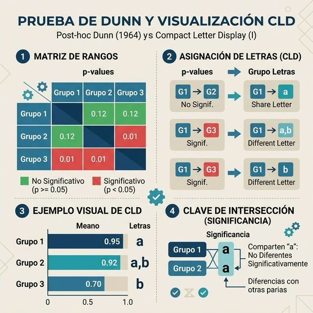
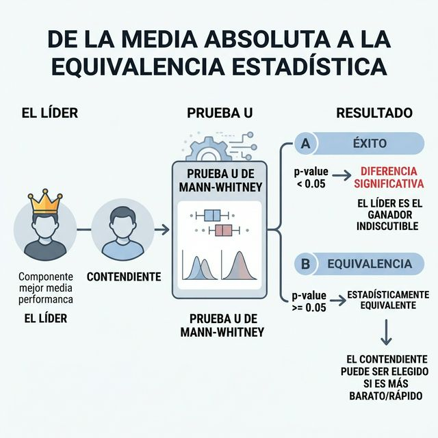
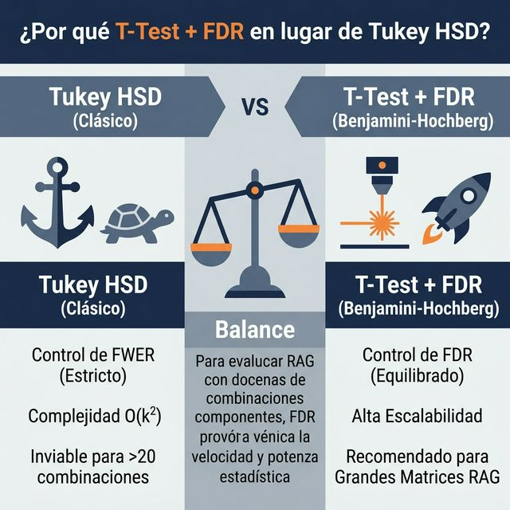
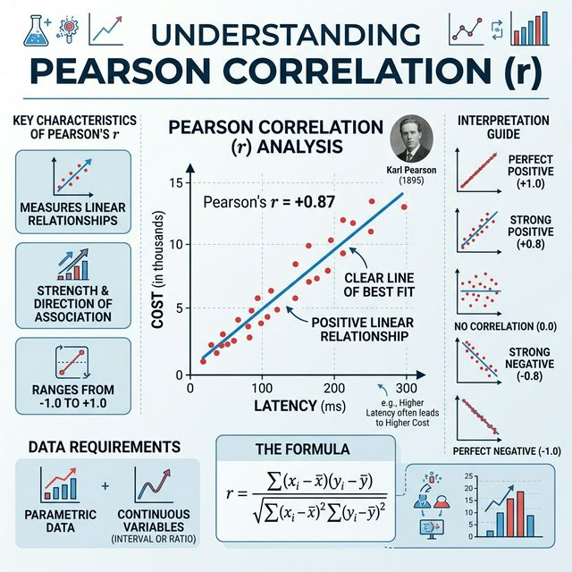
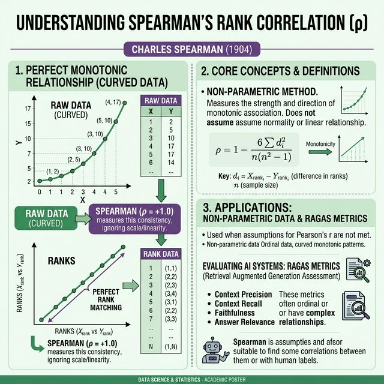

# Análisis Estadístico de Sistemas RAG: Metodología

Este documento describe el rigor estadístico aplicado en la evaluación de la matriz del RAG, detallando el flujo de trabajo para comparar las distintas tecnologías (Arquitecturas, DBs Vectoriales, Embeddings, Chunking y Generadores) de manera justa.

El pipeline estadístico implementado en `run_matrix_eval.py` diferencia dos familias de variables:

- **Variables no paramétricas** (métricas RAGAS acotadas en [0, 1]): `faithfulness_score`, `relevance_score`, `context_precision_score`, `answer_relevancy_score`. Estas métricas no siguen distribuciones normales y frecuentemente presentan asimetrías o límites duros en `0.0` y `1.0`, por lo que se aplica un pipeline **no paramétrico** (Kruskal-Wallis → Dunn → Mann-Whitney U).

- **Variables paramétricas** (continuas, sin límites fijos): `latency_retrieval_seg`, `latency_generation_seg`, `total_latency_seg`, `cost_est`. Son variables de tiempo y costo cuyos valores son continuos y sin techo artificial, por lo que se aplica un pipeline **paramétrico** (ANOVA de un factor → T-Test con corrección FDR → T-Test pareado).

---

## 1. Pipeline No Paramétrico (Métricas RAGAS)

### 1.1. Prueba Ómnibus: Kruskal-Wallis

**Propósito:** Determinar de forma global si hay diferencias significativas entre 3 o más grupos independientes.

**Proceso:**
* La prueba (implementada con `scipy.stats.kruskal`) clasifica todas las puntuaciones en rangos y comprueba si la distribución de rangos de algún grupo (por ejemplo, `faiss` vs `qdrant_local`) difiere significativamente de la distribución conjunta.
* **Hipótesis nula ($H_0$):** Todos los grupos de componentes provienen de la misma distribución (tienen medianas de desempeño similares).
* Si el **Valor-p (P-value) < 0.05**, rechazamos la hipótesis nula, lo que significa que **SÍ hay diferencia estadística validada** y podemos afirmar que al menos un componente/combinación es realmente superior o inferior al resto.

### 1.2. Pruebas Post-Hoc No Paramétricas

#### A. Prueba Post-hoc de Dunn con Compact Letter Display (CLD)

Dado que la prueba de Kruskal-Wallis es un análisis ómnibus que solo indica que *al menos un* grupo es diferente, el motor estadístico en `@eval/stat_engine.py` utiliza la **Prueba de Dunn (1964)** (*"Multiple comparisons using rank sums"*) para identificar específicamente cuáles son esas parejas discordantes.

**Fundamento Teórico y Algoritmo:**
Históricamente, Dunn propuso utilizar las sumas de rangos obtenidas en Kruskal-Wallis para realizar comparaciones uno a uno. La diferencia absoluta entre el rango medio de dos grupos ($|\bar{R}_i - \bar{R}_j|$) se escala mediante el error estándar de la diferencia para obtener un estadístico $z$.

En nuestro pipeline, este proceso se refuerza con:
1.  **Corrección de Benjamini-Hochberg (FDR-BH):** Aunque Dunn sugirió originalmente la corrección de Bonferroni, implementamos FDR-BH por su mayor potencia estadística. Esta corrección ajusta los p-values para controlar la tasa de falsos descubrimientos al realizar hasta 15 comparaciones cruzadas por factor.
2.  **Compact Letter Display (CLD):** Es un algoritmo de agrupación recursiva diseñado para simplificar la lectura de la matriz de p-values.

**¿Cómo interpretar las Letras (CLD)?**
El algoritmo asigna etiquetas de letras minúsculas (`a`, `b`, `c`...) basándose en el post-hoc:
*   **Grupos que comparten letras:** Si dos componentes comparten al menos una letra (ej. "a" y "ab"), **no hay diferencia significativa** entre ellos ($p \ge 0.05$). Son estadísticamente indistinguibles.
*   **Grupos sin letras en común:** Si un componente es "a" y otro es "b", la diferencia es **significativa** ($p < 0.05$). El que está posicionado más arriba en el ranking del informe es superior.

> [!TIP]
> **Ventaja Práctica:** El CLD permite visualizar clústeres de rendimiento. Si todas las estrategias de chunking terminan con la letra "a", significa que la elección de estrategia es irrelevante para esa métrica específica; si solo una tiene "a" y el resto "b", esa estrategia es la ganadora indiscutible.

---

#### B. Análisis de Robustez: Prueba U de Mann-Whitney (Wilcoxon Rank-Sum)

Para complementar la visión global de Kruskal-Wallis y las comparaciones múltiples de Dunn, el motor estadístico en `@eval/stat_engine.py` incorpora una validación binaria de impacto directo en toma de decisiones de negocio, basada en la propuesta seminal de **Mann y Whitney (1947)** (*"On a test of whether one of two random variables is stochastically larger than the other"*).

**Justificación y Fundamento Teórico:**
A diferencia de las pruebas paramétricas (como el T-Test) que asumen normalidad, la **Prueba U** es una prueba no paramétrica basada en rangos. Su objetivo es determinar si, dadas dos muestras independientes $X$ e $Y$, es más probable que un valor elegido al azar de una población sea mayor que uno de la otra ($P(X > Y) \neq P(Y > X)$). 

En el contexto de RAG, esta prueba es crítica porque:
1. Las métricas RAGAS (0 a 1) no suelen seguir distribuciones normales (suelen estar sesgadas hacia los extremos).
2. Permite identificar si la superioridad de una media es un fenómeno real o producto del ruido estadístico en muestras de tamaño $N=32$.

**Implementación del Algoritmo de "Equivalencia al Líder":**
El motor de evaluación implementa un pipeline de tres pasos para facilitar la lectura del "mejor componente":

1.  **Identificación del Líder:** Se selecciona el componente ($L$) que ostenta la mejor **Media Absoluta**. En métricas RAGAS es la media máxima; en latencia/costo es la media mínima.
2.  **Comparación Pairwise (Líder vs. Contendientes):** Para cada componente $C_i \neq L$, se ejecuta la función `mannwhitneyu(L_data, Ci_data, alternative='two-sided')`.
3.  **Detección de Equivalencia:**
    *   Si **p-value < 0.05**: Existe evidencia estadística suficiente para afirmar que la diferencia es real. El líder es superior al contendiente.
    *   Si **p-value ≥ 0.05**: No se puede rechazar la hipótesis nula. Aunque el líder tenga una media ligeramente mejor, ambos componentes son **Estadísticamente Equivalentes** (`Stat_Equivalent_to_Best = "SÍ"`).

> [!IMPORTANT]
> **Impacto en Producción:** Esta métrica es la más valiosa para el TFM. Si un modelo es estadísticamente equivalente al líder pero tiene un **costo 50% menor** o una **latencia inferior**, la metodología respalda la selección del modelo "equivalente" como la opción óptima para el despliegue.

---

## 2. Pipeline Paramétrico (Latencia y Costo)

### 2.1. Prueba Ómnibus: Análisis de Varianza de una vía (ANOVA)

**Propósito:** Determinar si existen diferencias significativas en las medias de latencia o costo entre 3 o más grupos de componentes RAG.

**Justificación:** A diferencia de las métricas RAGAS ([0, 1]), las variables de latencia (`latency_retrieval_seg`, `latency_generation_seg`, `total_latency_seg`) y costo estimado (`cost_est`) son **variables continuas** sin límites artificiales. Aunque pueden presentar cierta asimetría, el ANOVA de un factor es robusto frente a desviaciones moderadas de la normalidad cuando los tamaños muestrales son iguales o grandes (n ≥ 30 por grupo). En nuestro caso, cada combinación contiene 32 muestras, lo que garantiza la validez del supuesto por el **Teorema del Límite Central** (Fisher, 1925).

**Proceso:**
* La prueba (implementada con `scipy.stats.f_oneway`) calcula el estadístico F, que compara la variabilidad *entre* grupos con la variabilidad *dentro* de los grupos.
* **Hipótesis nula ($H_0$):** Todas las medias poblacionales de los grupos son iguales ($\mu_1 = \mu_2 = ... = \mu_k$).
* Si el **Valor-p (P-value) < 0.05**, rechazamos $H_0$, confirmando que al menos un componente exhibe una latencia o costo significativamente distinto al resto.

### 2.2. Pruebas Post-Hoc Paramétricas (Análisis de Pares)

Tras rechazar la hipótesis nula en el ANOVA, es imperativo realizar un análisis de comparaciones múltiples para identificar qué componentes específicos son los más eficientes.

#### A. T-Test de Student con corrección FDR (Benjamini-Hochberg) y CLD

**El dilema: ¿Por qué no usamos Tukey HSD?**
La prueba de **HSD de Tukey (1949)** (*Honestly Significant Difference*) es el estándar de oro tradicional. Sin embargo, su diseño para controlar la tasa de error por familia (FWER) basándose en la distribución estudentizada del rango presenta desafíos en este TFM:

1.  **Escalabilidad Exponencial:** En nuestra matriz, al evaluar combinaciones de 5 factores, generamos frecuentemente más de 20 grupos únicos. La computación de la matriz de Tukey para tal número de grupos es ineficiente y propensa a errores de memoria en librerías estándar.
2.  **Poder Estadístico vs. Conservadurismo:** Tukey es extremadamente conservador. En evaluaciones RAG con mucha variabilidad por el no-determinismo de los LLMs, el control estricto de FWER puede ocultar diferencias reales incipientes.

**La Solución Adoptada: T-Test Pareado + FDR (Benjamini-Hochberg, 1995)**
Implementamos la comparación de pares mediante el **T-Test de Student para muestras independientes** (`ttest_ind`), complementado con la **Corrección de FDR de Benjamini-Hochberg** en el motor estadístico de `@eval/stat_engine.py`. Este enfoque se justifica por:

*   **Robustez por N=32:** Según el **Teorema del Límite Central**, con 32 preguntas por combinación, la distribución de la media muestral tiende a la normalidad independientemente de la forma de la población original (Fisher, 1925), validando el uso del T-Test.
*   **Gestión del FDR:** La corrección BH controla la proporción esperada de falsos descubrimientos entre todos los resultados rechazados. Es el estándar moderno en campos con grandes volúmenes de datos donde interesa no perder potencia estadística frente a un control excesivamente rígido del error tipo I.

**Proceso de Visualización y CLD:**
*   Al igual que en el pipeline no paramétrico, generamos etiquetas de **Letras (CLD)**.
*   **Nota Crítica:** En latencia y costo, el **ranking es ascendente**. El componente con la letra "a" y la media más baja es el ganador en eficiencia.

#### B. T-Test de Comparación Directa vs. El Líder
Como validación final de "mínimo valor viable", se realiza un T-Test de una cola comparando a todos contra el componente con **mínima latencia/costo**. Si un modelo ("A") es más caro que el líder ("B") pero el p-value de su comparación directa es $\ge 0.05$, ambos se consideran **Estadísticamente Equivalentes**. Esto permite al analista elegir un modelo basándose en otros criterios cualitativos sin comprometer el rendimiento estadístico objetivo.

---

## 3. Análisis de Correlación Inter-Métrica

Para una evaluación holística, no basta con saber qué componente es mejor individualmente; es crucial entender cómo interactúan las métricas entre sí (ej. ¿sacrificamos latencia para obtener mayor precisión?). El sistema implementa un análisis de correlación dual:

### 3.1. Coeficiente de Correlación de Pearson ($r$)
Utilizado para las variables de rendimiento (Latencia y Costo). Propuesto por **Karl Pearson (1895)**, mide la fuerza y dirección de una relación lineal entre dos variables continuas.

*   **Aplicación:** Identificar si existe una relación proporcional directa (ej. a mayor tamaño de chunk, ¿aumenta linealmente el costo?).
*   **Supuestos:** Requiere que las variables sigan una distribución aproximadamente normal y que la relación sea lineal.

### 3.2. Coeficiente de Correlación de Spearman ($\rho$)
Utilizado para las métricas de calidad RAGAS y comparaciones cruzadas. Propuesto por **Charles Spearman (1904)**, es una medida no paramétrica que evalúa la relación utilizando el ranking de los datos en lugar de sus valores brutos.

*   **Aplicación:** Fundamental para las métricas RAGAS, ya que detecta relaciones monotónicas (si una variable crece, la otra también, aunque no sea de forma lineal). Es robusto ante valores atípicos (outliers) y distribuciones no normales.

---

## 4. ⚙️ Estructura del Resultado (`statistical_results.md`)
Cada vez que se ejecuta el análisis estadístico, el motor genera un informe detallado en `@eval/results/Matrix/` que incluye:
1.  **Resumen Metodológico:** Tipo de pipeline aplicado según la métrica.
2.  **Pruebas Ómnibus:** Valor-p global para detectar diferencias significativas.
3.  **Ranking con CLD:** Agrupamiento estadístico mediante letras.
4.  **Análisis de Equivalencia:** Identificación de componentes intercambiables con el líder.
5.  **Matriz de Correlación:** Mapa de calor con la relación entre todas las métricas.

---

## 5. 📚 Bibliografía y Referencias Técnicas

### 5.1. Fundamentos No Paramétricos
1.  **Kruskal-Wallis (1952)**: Kruskal, W. H., & Wallis, W. A. (1952). *Use of ranks in one-criterion variance analysis*. Journal of the American Statistical Association, 47(260), 583–621. [DOI: 10.1080/01621459.1952.10483441](https://doi.org/10.1080/01621459.1952.10483441).
2.  **Dunn (1964)**: Dunn, O. J. (1964). *Multiple comparisons using rank sums*. Technometrics, 6(3), 241–252. [DOI: 10.1080/00401706.1964.10490181](https://doi.org/10.1080/00401706.1964.10490181).
3.  **Mann-Whitney (1947)**: Mann, H. B., & Whitney, D. R. (1947). *On a test of whether one of two random variables is stochastically larger than the other*. The Annals of Mathematical Statistics, 18(1), 50–60. [DOI: 10.1214/aoms/1177730491](https://doi.org/10.1214/aoms/1177730491).
4.  **Spearman (1904)**: Spearman, C. (1904). *The proof and measurement of association between two things*. American Journal of Psychology, 15(1), 72–101. [DOI: 10.2307/1412159](https://doi.org/10.2307/1412159).
5. **Pohlert (2014)**: Pohlert, T. (2014). *The Pairwise Multiple Comparison of Mean Ranks Package (PMCMR)*. R package documentation. [Documentación en CRAN](https://CRAN.R-project.org/package=PMCMR). (Base metodológica para el cálculo de comparaciones múltiples y niveles de significancia).
6. **Eshel (2010)**: Eshel, G. (2010). *Rank-Based Nonparametric Statistical Tests*. Bard College. [Material de Curso/Notas Técnicas]. (Referencia para la lógica de ranking y el algoritmo de Compact Letter Display (CLD) en contextos no paramétricos).

### 5.2. Fundamentos Paramétricos
1.  **Fisher (1925)**: Fisher, R. A. (1925). *Statistical Methods for Research Workers*. Edinburgh: Oliver & Boyd. [DOI: 10.1038/116815a0](https://doi.org/10.1038/116815a0).
2.  **Student [Gosset] (1908)**: Student [W. S. Gosset]. (1908). *The Probable Error of a Mean*. Biometrika, 6(1), 1–25. [DOI: 10.1093/biomet/6.1.1](https://doi.org/10.1093/biomet/6.1.1).
3.  **Tukey (1949)**: Tukey, J. W. (1949). *Comparing Individual Means in the Analysis of Variance*. Biometrics, 5(2), 99-114. [DOI: 10.2307/3001913](https://doi.org/10.2307/3001913).
4.  **Pearson (1895)**: Pearson, K. (1895). *Notes on regression and inheritance in the case of two variables*. Proceedings of the Royal Society of London, 58, 240–242.
5.  **Benjamini-Hochberg (1995)**: Benjamini, Y., & Hochberg, Y. (1995). *Controlling the false discovery rate: A practical and powerful approach to multiple testing*. Journal of the Royal Statistical Society: Series B (Methodological), 57(1), 289–300. [DOI: 10.1111/j.2517-6161.1995.tb02031.x](https://doi.org/10.1111/j.2517-6161.1995.tb02031.x).
