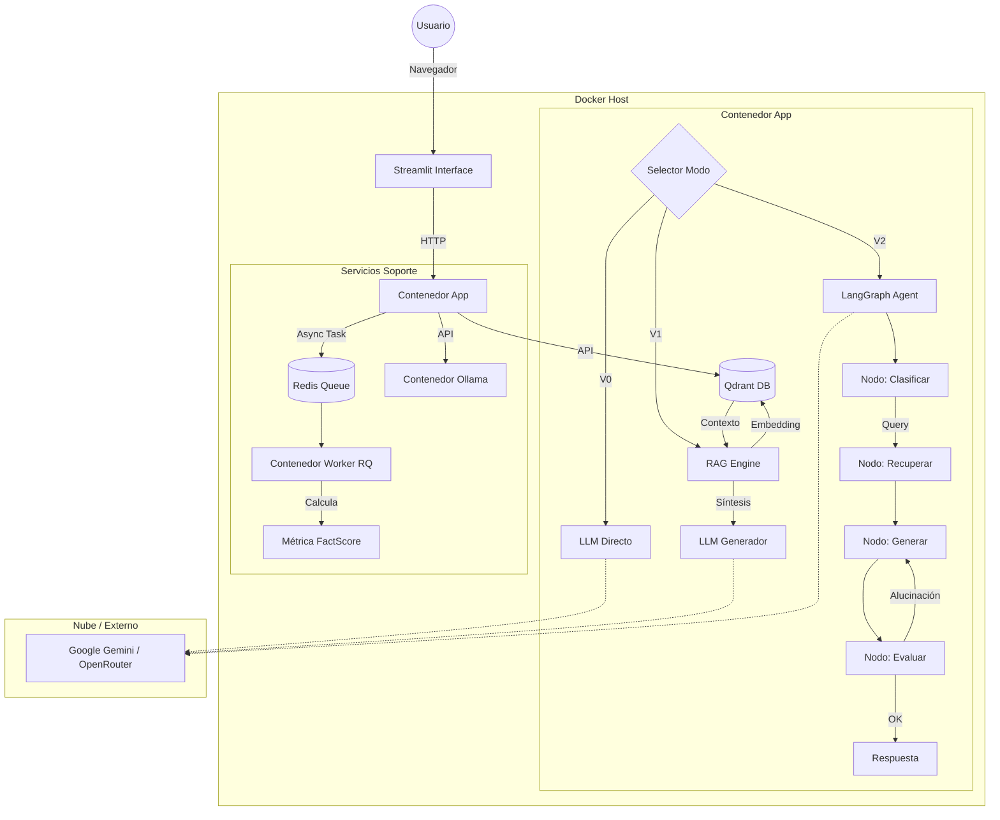

# Plan de Hitos Detallado — Chatbot TFM (LLM + RAG + Métricas)

## 1. Descripción General

Este Trabajo de Fin de Máster (TFM) desarrolla, evalúa y optimiza un sistema de **Chatbot con RAG (Retrieval-Augmented Generation)** especializado en el dominio agronómico (fitosanidad en arándanos). El proyecto aborda el problema crítico de las "alucinaciones" en los LLMs cuando se enfrentan a datos técnicos y normativos estrictos.

La solución implementa una arquitectura progresiva de tres niveles:
1.  **V0 (Baseline)**: Chatbot estándar sin contexto externo, susceptible a errores factuales.
2.  **V1 (RAG Pasivo)**: Sistema de recuperación densa con Qdrant y LangChain, que inyecta contexto normativo para "anclar" las respuestas.
3.  **V2 (Agente Autónomo)**: Sistema agéntico con grafos de estado (**LangGraph**) que incorpora ciclos de auto-corrección ("Self-Correction") y verificación de hechos antes de entregar la respuesta final.

El sistema final está contenerizado con **Docker** e incluye un dashboard interactivo en **Streamlit** para la evaluación continua de métricas de calidad (Faithfulness, FactScore).

---

## 2. Estructura del Proyecto

La estructura de directorios sigue un diseño modular para separar responsabilidades (Core, Chat, Ingesta, Métricas, evaluación):

```text
TFM-allucination/
├── .env                       # Variables de entorno (API keys, Config)
├── app.py                     # Punto de entrada de la aplicación Streamlit (UI)
├── docker-compose.yml         # Orquestación (App, Worker, Qdrant, Redis, Ollama)
├── Dockerfile                 # Definición de la imagen del contenedor principal
├── pyproject.toml             # Gestión de dependencias (uv) y configuración del proyecto
├── README.md                  # Documentación general de instalación y uso
├── corpus/                    # Gestión del conocimiento
│   ├── registry.yaml          # Registro de fuentes y metadatos con checksums
│   └── raw/                   # Archivos crudos descargados (PDFs, XLSX)
├── docs/                      # Documentación del proyecto
│   ├── ARQUITECTURA_Y_MANUAL.md # Diagramas y manual técnico
│   └── protocolo_experimental.md # Definición del experimento y métricas
├── eval/                      # Módulo de Evaluación
│   ├── question_bank_v1.csv   # Banco de preguntas (Golden Dataset)
│   ├── run_eval.py            # Script de evaluación masiva V0/V1
│   ├── run_eval_v2.py         # Script de evaluación asíncrona V2
│   └── results/               # Almacenamiento de logs y resultados JSON/CSV/Parquet
├── reports/                   # Generación de informes
│   ├── generate_report.py     # Lógica para reportes comparativos Markdown
│   └── final_integrated_report.md # Reporte consolidado de resultados
├── services/                  # Servicios en segundo plano
│   └── worker/                # Worker RQ para tareas pesadas (Métricas asíncronas)
└── src/                       # Código Fuente del Núcleo
    ├── agent/                 # Lógica del Agente V2 (LangGraph)
    ├── chat/                  # Cadenas de RAG V1 (LangChain)
    ├── core/                  # Configuración y Factory de Proveedores LLM
    ├── knowledge/             # Ingesta, Splitting e Indexación Vectorial
    └── metrics/               # Implementación de Métricas (Faithfulness, FactScore)
```

---

## 3. Herramientas y Tecnologías

El stack tecnológico se ha seleccionado para maximizar la reproducibilidad y la escalabilidad:

*   **Lenguaje**: Python 3.10+ (Tipado estricto).
*   **Gestión de Dependencias**: `uv` (Rápido y determinista).
*   **Orquestación LLM**: `LangChain` (Core) y `LangGraph` (Agentes de estado).
*   **Interfaz de Usuario**: `Streamlit` (Desarrollo rápido de aplicaciones de datos).
*   **Base de Datos Vectorial**: `Qdrant` (Motor de búsqueda vectorial de alto rendimiento, dockerizado).
*   **Gestión de Colas**: `Redis` + `RQ` (Redis Queue) para procesamiento asíncrono de métricas pesadas.
*   **Infraestructura**: `Docker` y `Docker Compose` para despliegue aislado y reproducible.
*   **Modelos LLM**:
    *   **Google Gemini** (vía `langchain-google-genai`).
    *   **Modelos OpenRouter** (vía `langchain-openai`).
    *   **Ollama** (Modelos locales para privacidad/costo).

---

## 4. Descripción Detallada de Hitos

A continuación se detalla cada hito completado, describiendo las acciones realizadas, los archivos clave y la evidencia de éxito.

### Hito 0: Protocolo Experimental y Criterios de Éxito
establecer las bases metodológicas del TFM, definiendo qué se va a comparar y cómo. Se diseñaron las variantes del sistema y se construyó el conjunto de datos de evaluación ("Golden Dataset").

*   **Entradas**:
    *   Conocimiento experto del dominio (Fitosanidad en arándanos).
    *   Normativa oficial (SENASA, SAG, EPA) y papers científicos.
*   **Salidas**:
    *   Nuevo archivo: `docs/protocolo_experimental.md`.
    *   Nuevo archivo: `eval/question_bank_v1.csv` (12 preguntas "Gold Standard").

*   **Acciones Realizadas**:
    1.  Redacción del `protocolo_experimental.md` definiendo V0 (Baseline), V1 (RAG) y V2 (Agente).
    2.  Creación manual del `question_bank_v1.csv` con 12 preguntas de alta complejidad sobre normativa fitosanitaria (SENASA, SAG, EPA).
    3.  Definición de categorías de preguntas (Plagas, Riego, Exportación) y niveles de dificultad.
    4.  Establecimiento de métricas clave: Fidelidad (Faithfulness), FactScore y Latencia.

*   **Archivos Clave**:
    *   `docs/protocolo_experimental.md`: Documento maestro del diseño experimental.
    *   `eval/question_bank_v1.csv`: Dataset con columnas `id`, `question`, `ground_truth`, `source_doc`.

*   **Métricas de Éxito**:
    *   Protocolo validado y documentado.
    *   Banco de preguntas cubre diversas fuentes documentales reales.

### Hito 1: Proyecto Base y Configuración de Proveedores
Crear la infraestructura de código mínima para invocar LLMs de múltiples proveedores sin errores de configuración.

*   **Entradas**:
    *   Credenciales de API (Google AI Studio, OpenRouter).
*   **Salidas**:
    *   Archivos modificados: `pyproject.toml`, `.gitignore`.
    *   Nuevos archivos: `src/core/config/settings.py`, `src/core/providers/*`.
    *   Nuevo archivo: `tests/test_providers_smoke.py`.

*   **Acciones Realizadas**:
    1.  Estructuración del repositorio según buenas prácticas (`src/core`).
    2.  Implementación de `settings.py` con `pydantic-settings` para validar variables de entorno (`.env`).
    3.  Desarrollo del `ProviderFactory` (`src/core/providers/factory.py`) para instanciar dinámicamente Gemini, OpenRouter y Ollama.
    4.  Creación de tests de humo (`tests/test_providers_smoke.py`) para verificar conectividad.

*   **Archivos Clave**:
    *   `src/core/config/settings.py`: Validación de tipos para API Keys.
    *   `src/core/providers/gemini.py`, `openrouter.py`, `ollama.py`: Wrappers específicos.
    *   `pyproject.toml`: Definición de dependencias.

*   **Métricas de Éxito**:
    *   Tests automáticos pasan confirmando que los LLMs responden "pong" al ping.
    *   Variables de entorno gestionadas de forma segura.

### Hito 2: Registro de Modelos (Model Registry)
Evitar errores en tiempo de ejecución por nombres de modelos incorrectos y centralizar la gestión de capacidades (context length, pricing).

*   **Entradas**:
    *   Conectividad a API OpenRouter (endpoint `/models`).
*   **Salidas**:
    *   Nuevo archivo: `scripts/sync_model_registry.py`.
    *   Nuevo archivo: `src/core/config/model_registry.json`.

*   **Acciones Realizadas**:
    1.  Creación del script `scripts/sync_model_registry.py` que consulta la API de OpenRouter y genera un JSON local.
    2.  Implementación de `src/core/config/model_registry.json` como fuente de verdad para la UI.
    3.  Integración del registro en `ProviderFactory` para validar `model_id` antes de invocar la API.

*   **Archivos Clave**:
    *   `scripts/sync_model_registry.py`: Script asíncrono de actualización.
    *   `src/core/config/model_registry.json`: Base de datos ligera de modelos disponibles.

*   **Métricas de Éxito**:
    *   Selector de modelos en la UI se puebla dinámicamente desde el JSON.
    *   Prevención de crashes por *typos* en nombres de modelos.

### Hito 3: Chat Baseline (V0) en Streamlit
Tener una interfaz funcional para interactuar con los LLMs de forma directa, sirviendo como línea base de comparación.

*   **Entradas**:
    *   `src/core/providers` (funcionalidad de backend).
*   **Salidas**:
    *   Nuevo archivo: `app.py`.

*   **Acciones Realizadas**:
    1.  Desarrollo de `app.py` utilizando `st.chat_message` y gestión de estado de sesión (`st.session_state`).
    2.  Implementación de selectores de configuración (Proveedor, Modelo) en la barra lateral.
    3.  Conexión directa: `Prompt` -> `LLM` -> `Respuesta`.

*   **Archivos Clave**:
    *   `app.py`: Código fuente de la interfaz.

*   **Métricas de Éxito**:
    *   Conversación fluida con historial mantenido en memoria.
    *   Cambio de modelo en caliente funcional.

### Hito 4: Harness de Evaluación Automática (V0)
Automatizar la medición del desempeño del modelo base para tener datos cuantitativos iniciales.

*   **Entradas**:
    *   `eval/question_bank_v1.csv` (Dataset).
*   **Salidas**:
    *   Nuevo archivo: `eval/run_eval.py`.
    *   Nuevos archivos: `eval/results/Comparison/*.csv` y `*.parquet`.

*   **Acciones Realizadas**:
    1.  Creación de `eval/run_eval.py` para iterar sobre el `question_bank_v1.csv`.
    2.  Implementación de lógica de reintentos y manejo de errores por API rate limits.
    3.  Guardado de resultados en formato CSV y Parquet en `eval/results/`.

*   **Archivos Clave**:
    *   `eval/run_eval.py`: Motor de evaluación síncrono.
    *   `eval/results/Comparison/`: Directorio de salidas.

*   **Métricas de Éxito**:
    *   Ejecución completa del banco de preguntas sin supervisión.
    *   Generación de logs de latencia y respuestas crudas.

### Hito 5: Adquisición y Curación del Corpus RAG
Construir una base de conocimiento confiable y trazable para el sistema RAG.

*   **Entradas**:
    *   URLs de documentos públicos (SENASA, SAG, Universities).
*   **Salidas**:
    *   Nuevo archivo: `corpus/registry.yaml` (Metadata inicial).
    *   Nuevo archivo: `scripts/acquire_corpus.py`.
    *   Archivos generados: PDFs en `corpus/raw/`.

*   **Acciones Realizadas**:
    1.  Definición de documentos en `corpus/registry.yaml` con metadatos (título, año, país, checksum).
    2.  Desarrollo de `scripts/acquire_corpus.py` para descargar PDFs y validar su integridad (SHA256).
    3.  Inclusión de manuales técnicos, normativas legales y papers científicos reales.

*   **Archivos Clave**:
    *   `corpus/registry.yaml`: Fuente de verdad documental.
    *   `scripts/acquire_corpus.py`: Gestor de descargas idempotente.

*   **Métricas de Éxito**:
    *   Carpeta `corpus/raw/` poblada con archivos validados.
    *   Registro YAML actualizado automáticamente con checksums reales.

### Hito 6 & 7: Ingesta y Vectorización con Qdrant
Transformar los documentos PDF/Excel en vectores buscables de alta calidad.

*   **Entradas**:
    *   Archivos en `corpus/raw/` (PDF, XLSX).
    *   Servicio Qdrant (Docker).
*   **Salidas**:
    *   Nuevos archivos: `src/knowledge/loaders.py`, `src/knowledge/indexer.py`.
    *   Colección persistida en volumen Docker `qdrant_storage`.

*   **Acciones Realizadas**:
    1.  Configuración de contenedor Qdrant en `docker-compose.yml`.
    2.  Implementación de `src/knowledge/loaders.py` para manejar PDF (`PyPDFLoader`) y Excel (Pandas a Markdown).
    3.  Desarrollo de `src/knowledge/indexer.py` para dividir textos (`RecursiveCharacterTextSplitter`) y cargarlos a Qdrant.
    4.  Uso de embeddings de OpenAI/Gemini (vía `EmbeddingFactory`) para la representación vectorial.

*   **Archivos Clave**:
    *   `src/knowledge/loaders.py`: Estrategias de carga polimórficas.
    *   `src/knowledge/indexer.py`: Script de indexación masiva.
    *   `docker-compose.yml`: Definición del servicio Qdrant.

*   **Métricas de Éxito**:
    *   Colección Qdrant creada y poblada con chunks.
    *   Metadatos (origen, página) preservados en cada vector.

### Hito 8: Chat RAG (V1)
Integrar la recuperación de información en el flujo de chat para fundamentar las respuestas.

*   **Entradas**:
    *   Colección indexada en Qdrant.
*   **Salidas**:
    *   Nuevo archivo: `src/chat/rag.py`.
    *   Modificación: `app.py` (Tab V1).

*   **Acciones Realizadas**:
    1.  Creación de `src/chat/rag.py` definiendo la cadena `Retrieve` -> `Augment` -> `Generate`.
    2.  Diseño de prompts específicos para forzar la citación de fuentes.
    3.  Integración en `app.py`: Pestaña "V1 (RAG)" con visualización de fuentes recuperadas ("Sources").

*   **Archivos Clave**:
    *   `src/chat/rag.py`: Lógica del motor RAG.
    *   `app.py`: Renderizado de componentes expansibles (st.expander) para evidencias.

*   **Métricas de Éxito**:
    *   Respuestas del chatbot incluyen referencias explícitas a los documentos.
    *   Reducción subjetiva de invenciones en preguntas de normativa.

### Hito 9: Evaluación Comparativa V0 vs V1
Medir cuantitativamente el impacto de introducir RAG frente al baseline.

*   **Entradas**:
    *   Modelos V0 y V1 operativos.
    *   `eval/run_eval.py` actualizado.
*   **Salidas**:
    *   Nuevo archivo: `reports/generate_report.py`.
    *   Archivo generado: `reports/v0_vs_v1_comparative.md`.

*   **Acciones Realizadas**:
    1.  Ejecución de `eval/run_eval.py` en modo comparativo (ejecuta ambos modelos para cada pregunta).
    2.  Generación de reportes automáticos (`reports/generate_report.py`) que muestran latencias y respuestas lado a lado.
    3.  Análisis manual de mejoras en especificidad (V1 suele ser más preciso en datos numéricos).

*   **Archivos Clave**:
    *   `reports/v0_vs_v1_comparative.md`: Informe generado.

*   **Métricas de Éxito**:
    *   Evidencia documentada de la superioridad de V1 en preguntas de "dato exacto".
    *   Identificación del trade-off de latencia (V1 es más lento).

### Hito 10: Métricas de Alucinación (Faithfulness)
Implementar métrica de "Fidelidad" para verificar si la respuesta se adhiere al contexto.

*   **Entradas**:
    *   Respuestas de V1 (RAG).
*   **Salidas**:
    *   Nuevo archivo: `src/metrics/faithfulness.py`.
    *   Actualización: `eval/run_metrics.py`.

*   **Acciones Realizadas**:
    1.  Implementación de `src/metrics/faithfulness.py`: Prompt diseñado para LLM-as-a-Judge que evalúa si la respuesta se deriva **exclusivamente** del contexto.
    2.  Integración en script de evaluación para correr post-hoc.

*   **Archivos Clave**:
    *   `src/metrics/faithfulness.py`: Clase de métrica.
    *   `src/metrics/judges.py`: Factory para el LLM evaluador.

*   **Métricas de Éxito**:
    *   Scores consistentes (0.0 o 1.0) al evaluar alucinaciones inducidas vs respuestas correctas.

### Hito 11: Métrica 2: FactScore (Hechos Atómicos)
Implementar FactScore para una evaluación granular de precisión factual.

*   **Entradas**:
    *   Respuestas V1/V2.
*   **Salidas**:
    *   Nuevo archivo: `src/metrics/factscore.py`.
    *   Nuevo script: `eval/run_factscore.py`.

*   **Acciones Realizadas**:
    1.  Implementación de `src/metrics/factscore.py` con dos etapas:
        *   **Extracción**: Descomposición de texto en "afirmaciones atómicas".
        *   **Verificación**: Validación de cada afirmación contra el contexto (`Soportado`, `Contradicho`, `NoVerificado`).
    2.  Ejecución de prueba sobre respuestas generadas.

*   **Archivos Clave**:
    *   `src/metrics/factscore.py`: Motor FactScore simplificado.
    *   `eval/run_factscore.py`: Runner específico para esta métrica costo-intensiva.

*   **Métricas de Éxito**:
    *   Desglose detallado de qué partes de una oración son falsas.

### Hito 12: Agente Mitigador (V2 - LangGraph)
Cerrar el ciclo de control: crear un agente que use las métricas para corregirse a sí mismo.

*   **Entradas**:
    *   Componentes V1 (Writer, Retriever).
    *   Métrica Faithfulness.
*   **Salidas**:
    *   Nuevos archivos: `src/agent/graph.py`, `src/agent/state.py`, `src/agent/nodes.py`.
    *   Modificación: `app.py` (Tab V2).

*   **Acciones Realizadas**:
    1.  Diseño del grafo en `src/agent/graph.py` usando `LangGraph`.
    2.  Nodos implementados (`src/agent/nodes.py`):
        *   `classify`: Detecta intención.
        *   `retrieve`: Busca información.
        *   `generate`: Crea borrador.
        *   `grade`: Evalúa alucinación.
    3.  Lógica de Loop: Si `grade` detecta falla, el grafo re-entra al nodo `generate` (limitado por retries).

*   **Archivos Clave**:
    *   `src/agent/graph.py`: Definición de aristas y flujos condicionales.
    *   `src/agent/nodes.py`: Funciones puras de ejecución.

*   **Métricas de Éxito**:
    *   El agente reescribe respuestas detectadas como alucinadas en los logs.
    *   Alta puntuación final de Faithfulness en el reporte comparativo.

### Hito 13: Asincronía y Workers
Optimizar la UX moviendo las tareas pesadas de evaluación a segundo plano.

*   **Entradas**:
    *   Infraestructura Redis.
*   **Salidas**:
    *   Nuevos archivos: `services/worker/tasks.py`.
    *   Modificación: `docker-compose.yml`.

*   **Acciones Realizadas**:
    1.  Configuración de `redis` y `worker` en `docker-compose.yml`.
    2.  Creación de tareas en `services/worker/tasks.py` para calcular FactScore.
    3.  (Parcial) Integración en UI para no bloquear el chat mientras se evalúa.

*   **Archivos Clave**:
    *   `services/worker/tasks.py`: Definición de trabajos en cola.
    *   `docker-compose.yml`: Servicio de colas.

*   **Métricas de Éxito**:
    *   Contenedor `worker` procesando tareas (logs visibles en Docker).

### Hito 14: Reporte Integrado Final
Consolidar la evidencia científica del TFM.

*   **Entradas**:
    *   Resultados de benchmarks V0, V1, V2.
*   **Salidas**:
    *   Archivo generado: `reports/final_integrated_report.md`.

*   **Acciones Realizadas**:
    1.  Ejecución de benchmark completo (V0/V1/V2).
    2.  Generación de `reports/final_integrated_report.md` con tablas comparativas.

*   **Archivos Clave**:
    *   `reports/final_integrated_report.md`.

### Hito 15: Automatización Docker y UI de Evaluación Interactiva
El entregable final "llave en mano".

*   **Entradas**:
    *   Código fuente completo y testeado.
*   **Salidas**:
    *   Nuevo archivo: `Dockerfile`.
    *   Archivo modificado: `docker-compose.yml` (App + Ollama).
    *   Modificación: `app.py` (Tab "Reportes & Eval").

*   **Acciones Realizadas**:
    1.  Creación del `Dockerfile` final optimizado con `uv`.
    2.  Configuración completa de red en `docker-compose.yml` (comunicación inter-contenedores: app -> ollama, app -> qdrant).
    3.  Desarrollo de la pestaña "📊 Reportes & Eval" en Streamlit para correr benchmarks sin tocar código.
    4.  Visualización de progreso en tiempo real y descarga de reportes MD.

*   **Archivos Clave**:
    *   `Dockerfile`: Imagen de producción.
    *   `docker-compose.yml`: Orquestador final.
    *   `app.py`: Nueva lógica de UI para el runner.

*   **Métricas de Éxito**:
    *   Despliegue exitoso con `docker-compose up --build`.
    *   Usuario final puede ejecutar evaluación y descargar reporte desde el navegador.

---

## 5. Flujograma General del Sistema



---

## 6. Bibliografía y Referencias Clave

*   **LangChain Documentation**: https://python.langchain.com/
*   **LangGraph**: https://langchain-ai.github.io/langgraph/
*   **DeepEval / RAGAS**: Inspiración para métricas de `Faithfulness` y `Context Relevancy`.
*   **FactScore**: Min et al. (2023) "FActScore: Fine-grained Atomic Evaluation of Factual Precision in Long Form Text Generation".
*   **Self-RAG**: Asai et al. (2023) "Self-RAG: Learning to Retrieve, Generate, and Critique through Self-Reflection".
